#  {text-align="center" data-menu-title="Introduction"}

```{r}
#| echo: false
library(tidyverse)
library(fontawesome)
library(crayon)
library(knitr)
library(ggthemes)
library(kableExtra)
library(directlabels)
library(ggtext)
library(plotly)
library(showtext)
library(countrycode)
library(readxl)
library(gt)
library(gtExtras)
library(countdown)
library(here)

knitr::knit_hooks$set(crop = knitr::hook_pdfcrop)
```
 
<br><br><br><br>

::: title
Research Seminar
:::

::: subtitle
Week 1: Course presentation
:::

::: author
Sergi Martínez
:::

<br><br><br><br>

::: media
`r fontawesome::fa(name = "envelope", fill = "#2A363B")` [smsoler\@clio.uc3m.es]{style="color:#1DA1F2"} \| `r fontawesome::fa(name = "clock", fill = "#2A363B")` [Office hours: Tuesdays 10:00–13:00 (by email)]{style="color:#2A363B"}
:::

<!-- NOTE for Sergi: the bio below reuses the topics from the previous version of the
deck (conflict, violence, transitional justice; Spain, Greece, Italy, Colombia).
Edit freely if your line-up of cases/courses at UC3M is different this year. -->

## About me

::: columns
::: {.column width="50%"}

I am a member of the political science faculty at Universidad Carlos III de Madrid.

::: fragment

- PhD from EUI (Italy)

- Postdoctoral or teaching positions at Princeton (US), EAFIT (Colombia), ETH (Switzerland)
:::
::: fragment

**Teaching**

This semester I am teaching:

- *Seminario de Investigación*
:::
:::

::: {.column width="8%"}
:::

::: {.column width="41%"}
::: fragment
**Research**

Political violence and political behaviors

- Spain

- Colombia

- More at: <https://sergimartinez.github.io/>

:::
:::

:::

## Your turn {.center}

[random sample]

Name, expectations, and a topic you're curious about

```{css}
.center h2 {
  text-align: center;
}
```


## What is this course? {transition="fade" transition-speed="fast" auto-animate="true"}

- Last compulsory course of the BA. 

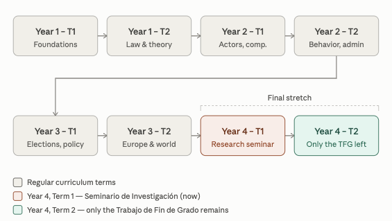{width=40% fig-align="center"}


- **Goal**: Learn how to write the BA thesis. 


## Course objectives {.scrollable .nostretch transition="fade" transition-speed="fast" auto-animate="true"}

To write a good BA thesis: 

1. Read, understand, criticise research articles

2. Strengthen your analytical toolkit

- Programming language (R)

- Statistics and *quantitative* research methods

- *Qualitative* research techniques

- Causality and research design (the logic of comparison, causal identification)

. . .

Analyze **differences and similarities** to establish causes and consequences (explanatory political science)

. . .

<br>

3. Develop an empirical (rigorous) research project

- Collect, process, and interpret data to test hypotheses that fill them

. . .

4. Tell a story. The best articles---the most read and most cited---are the ones that tell a compelling story.

## What we're aiming for {.scrollable transition="fade" transition-speed="fast" auto-animate="true"}

Getting comfortable with how political science research is actually done today. It should be:

1. inductive

2. empirical

3. causal

4. reproducible

5. scalable

## Causality {.scrollable}

What do you think it is?

- A relationship between two or more events whose consistent occurrence and sequence lets us attribute the appearance of one to the other.

. . .

- We compare things to uncover causes. An example:

*Is it better to be born in December, or in January? Do we gain a year, or lose one?*

. . .

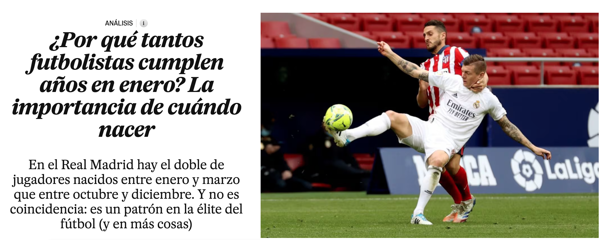{width=75% fig-align="center"}

## What we're aiming for (II) {.scrollable transition="fade" transition-speed="fast" auto-animate="true"}

**R**:

- Get comfortable working with it

- Improve how we handle and manage datasets

- Visualize data informatively

- Apply empirical methods of analysis

. . .

**Reading political science**: <https://scholar.google.com/>

- Top journals: American Political Science Review, American Journal of Political Science, Journal of Politics, British Journal of Politics 

- Field Journals: Comparative Political Studies, International Organization, Journal of Conflict Resolution, Gender and Politics, Political Behavior


## One of my own projects {.scrollable}

The legacy of the Spanish Civil War in political behavior

. . .

::: {style="position: relative; width: 70%; height: 800px; margin: 0 auto;"}

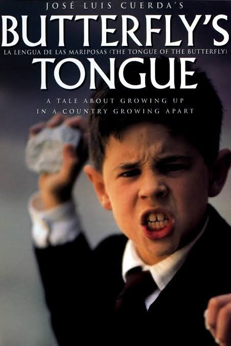{.fragment style="position: absolute; top: 0; left: 0%; width: 40%; z-index: 1;"}

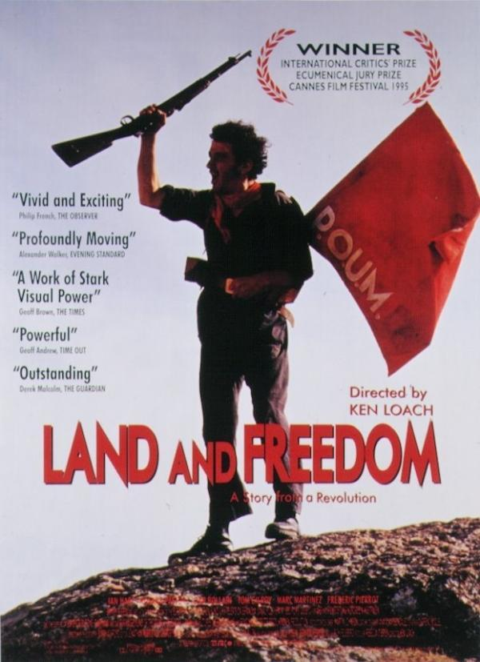{.fragment style="position: absolute; top: 0; left: 24%; width: 40%; z-index: 2;"}

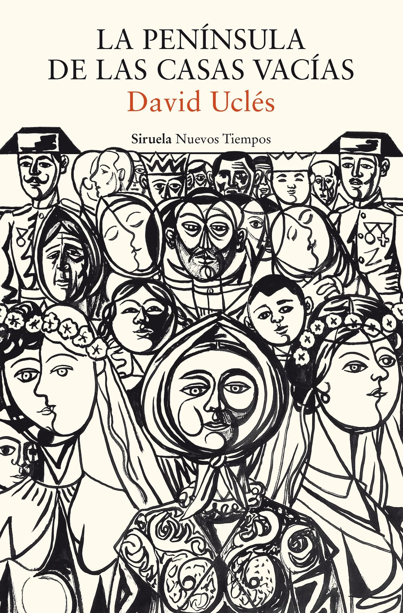{.fragment style="position: absolute; top: 0; left: 48%; width: 40%; z-index: 3;"}

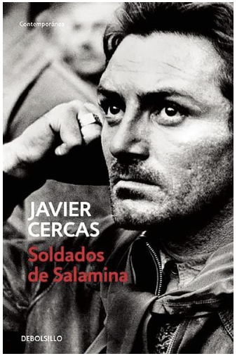{.fragment style="position: absolute; top: 0; left: 72%; width: 40%; z-index: 4;"}

:::

## One of my own projects {.scrollable}

- **Question**: Does violence leave a legacy on political behavior? 

::: {style="position: relative; width: 70%; height: 800px; margin: 0 auto;"}

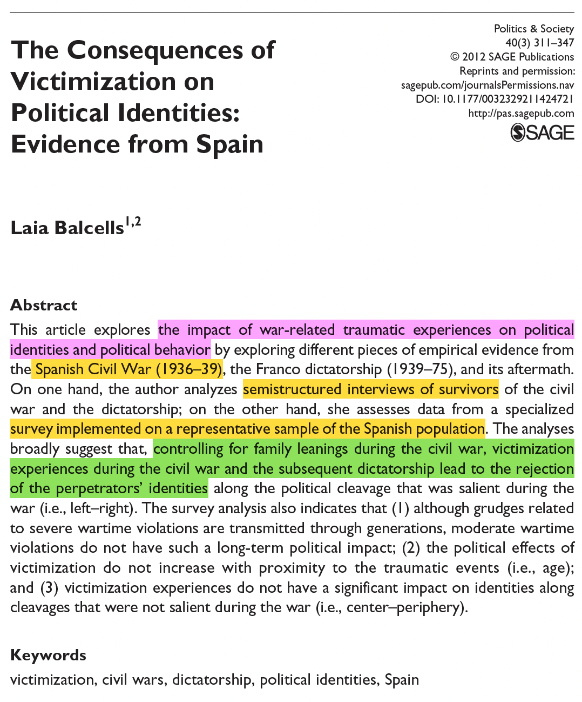{.fragment style="position: absolute; top: 0; left: 0%; width: 45%; z-index: 1;"}

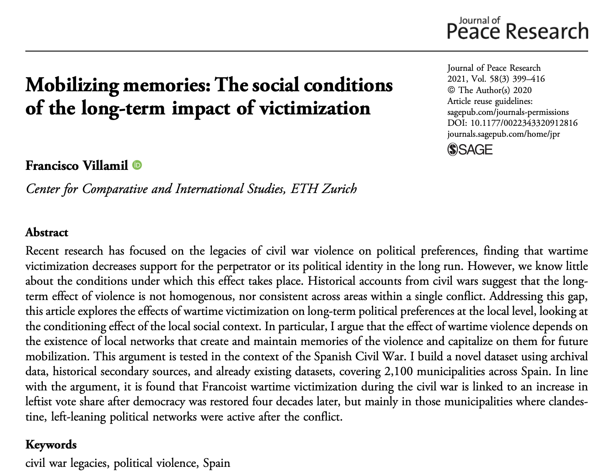{.fragment style="position: absolute; top: 0; left: 30%; width: 65%; z-index: 2;"}

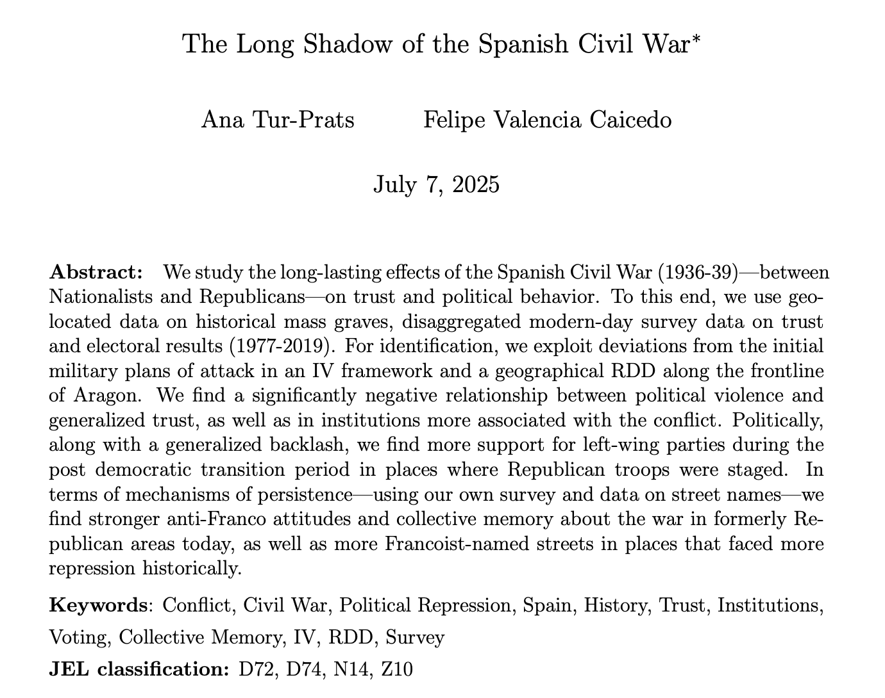{.fragment style="position: absolute; top: 0; left: 60%; width: 60%; z-index: 3;"}

:::

## One of my own projects {.scrollable}

- **Question**: Does violence leave a legacy on political behavior? **Does violence affect behavior uniformly?**

- **My argument**: No, it depends on the *type* of violence (indiscriminate vs. selective)

. . .

- **Case**: The legacy of the Spanish Civil War in the Basque Country. Did the fascist bombings (1937) contribute to the development of Basque nationalism? Did selective killings have the same effect?

::: columns

::: {.column width="45%"}
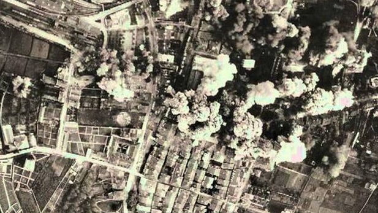{width=99% fig-align="center"}
:::

::: {.column width="9%"}
:::

::: {.column width="45%"}
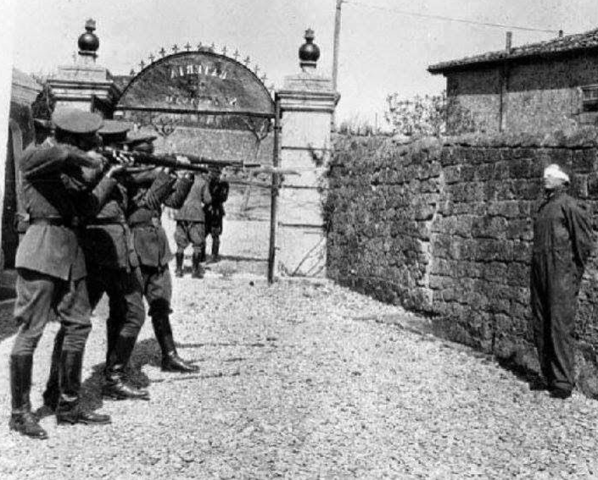{width=70% fig-align="center"}
:::

:::

. . .

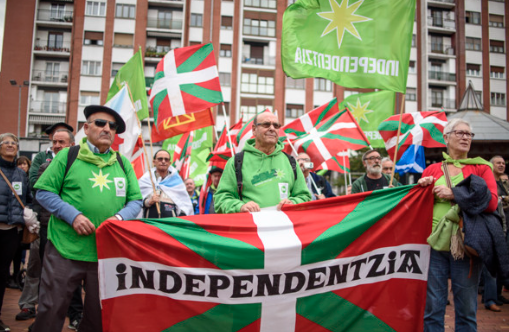{width=60% fig-align="center"}

## One of my own projects (II) {.scrollable}


- **Findings/Evidence**:

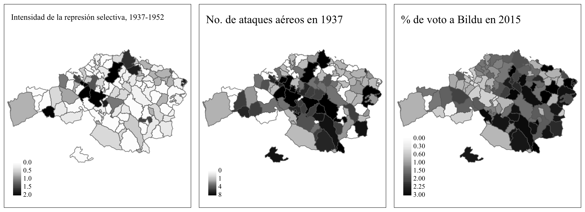{width=98% fig-align="center"}

. . .

<br>

:::small
- **What's the underlying assumption behind the 'causal interpretation' of these results?**
:::

## 


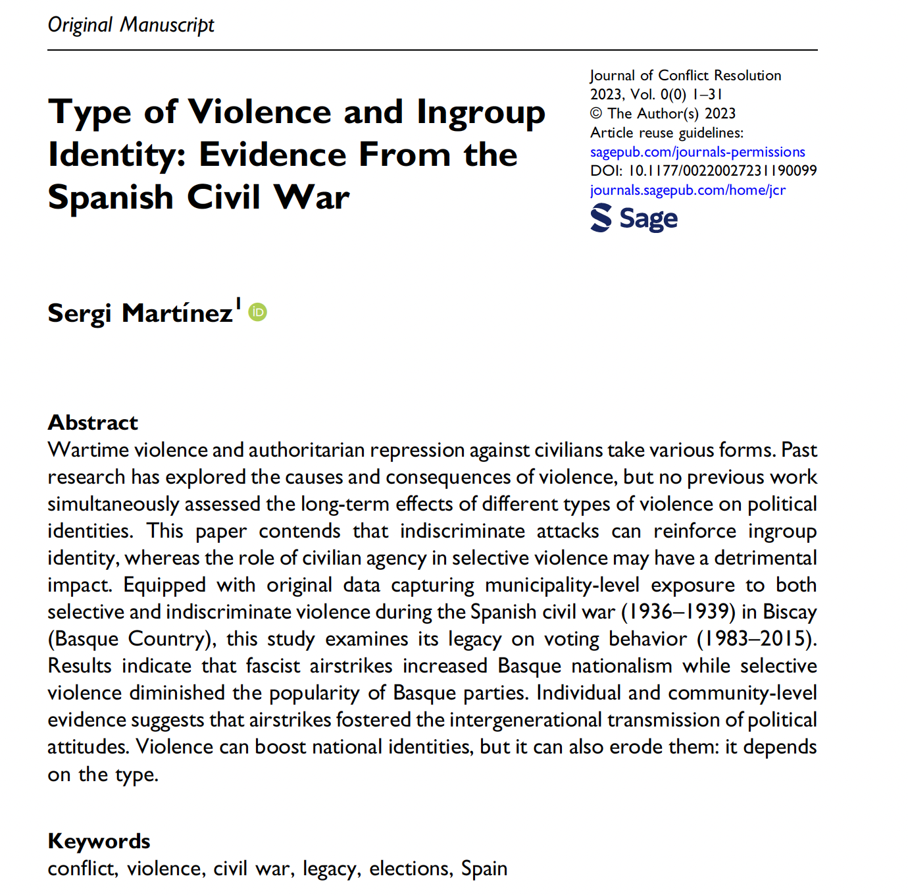{width=65% fig-align="center"}

[Full article](https://journals.sagepub.com/doi/full/10.1177/00220027231190099)


## Course structure: two types of sessions {.scrollable}


- **Lecture (MAG, Fridays)** — 14 sessions on research design and quantitative methods, from the logic of scientific inquiry to difference-in-differences designs, including an introduction to R

- **Seminar (RED, Mondays)** — 10 sessions combining critical discussion of assigned readings, presentation of group work, and applied practice in R


. . .

```{r}

#| echo: false
schedule_tbl <- data.frame(
  Week = c(
    "Sept 7", "Sept 14", "Sept 21", "Sept 28", "Oct 5", "Oct 12",
    "Oct 19", "Oct 26", "Nov 2", "Nov 9", "Nov 16", "Nov 23",
    "Nov 30", "Dec 7", "Dec 14"
  ),
  Seminars = c(
    "CANCELLED", "S1 — Sept 14", "S2 — Sept 21", "S3 — Sept 28", "S4 — Oct 5",
    "— (holiday, Oct 12)", "S5 — Oct 19", "S6 — Oct 26", "— (holiday, Nov 2)",
    "S7 — Nov 9", "S8 — Nov 16", "S9 — Nov 23", "S10 — Nov 30", "— (holiday, Dec 7)", "— (study break)"
  ),
  Lectures = c(
    "L1 — Sept 11", "L2 — Sept 18", "L3 — Sept 25", "L4 — Oct 2", "L5 — Oct 9",
    "L6 — Oct 16", "L7 — Oct 23", "L8 — Oct 30", "L9 — Nov 6", "L10 — Nov 13",
    "L11 — Nov 20", "L12 — Nov 27", "L13 — Dec 4", "L14 — Dec 11", "Dec 18 - Final exam"
  ),
  Notes = c(
    "Group formation", "", "", "Task I due Sept 27", "", "", "", "", "",
    "", "Task II due Nov 15", "", "Task III due Nov 29; progress presentations",
    "Last day of classes", "Final evaluation"
  ),
  stringsAsFactors = FALSE
)

knitr::kable(schedule_tbl, align = c("l", "l", "l", "l")) |>
  kableExtra::kable_styling(font_size = 20, full_width = TRUE) |>
  kableExtra::column_spec(1, width = "6em", bold = TRUE) |>
  kableExtra::column_spec(2, width = "13em") |>
  kableExtra::column_spec(3, width = "10em") |>
  kableExtra::column_spec(4, width = "18em")

```

Three Mondays fall on public holidays (Oct 12, Nov 2, Dec 7) — those weeks have a lecture only, no seminar

::: small

- Slides are shared *after* each session

- Readings must be completed *before* each session

- Lectures combine presentation with **spaces for discussion** aka. come with questions on the readings

:::

## Course structure: how the grade is built {.scrollable}

```{r}
#| echo: false
eval_tbl <- data.frame(
  Component = c(
    "1. Final written exam (individual, in class, no computers)",
    "2. Group paper critical presentation (in seminar)",
    "3. Three critical questions (across seminars)",
    "4. Group project I — motivation, RQ, lit. review, hypotheses (~1,500 words)",
    "5. Group project II — qualitative design, data (~2,500 words)",
    "6. Group project III — quantitative design, causal ID beyond OLS, analysis (~4,000 words)"
  ),
  Weight = c("40%", "10%", "10%", "10%", "15%", "15%"),
  stringsAsFactors = FALSE
)

knitr::kable(eval_tbl, align = c("l", "r"), col.names = c("Component", "Weight")) |>
  kableExtra::kable_styling(font_size = 35, full_width = TRUE) |>
  kableExtra::column_spec(1, width = "30em") |>
  kableExtra::column_spec(2, width = "5em", bold = TRUE)
```

. . .

A minimum grade of **3.5/10 on the exam** is required to pass the course. Final exam: **Friday, Dec 18, 2026**.

## Course structure: the group project {.scrollable}

Groups are formed in the first seminar. Each project develops in three steps:

```{r}

#| echo: false
proj_tbl <- data.frame(
  Part = c(
    "1. Motivation, question, brief argument based on prior literature",
    "2. Fix mistakes; qualitative design; brief data collection and analysis",
    "3. Fix mistakes; quantitative design; data collection, analysis, interpretation"
  ),
  Weight = c("10%", "15%", "15%"), 
  Presentation = c("Sept 28", "Oct 19", "Nov 23"),
  Submission   = c("Oct 1",  "Oct 22", "Nov 26"),
  stringsAsFactors = FALSE
)

knitr::kable(proj_tbl, align = c("l", "c", "c", "c")) |>
  kableExtra::kable_styling(font_size = 35, full_width = TRUE) |>
  kableExtra::column_spec(1, width = "28em")

```

. . .

**Office hours**: request by email, Tuesdays 10:00–13:00. Use them — a project that drifts off course, or a script that doesn't compile, is the biggest risk to your grade.

## A note on using AI tools

- ChatGPT, Claude, and similar tools are **powerful aids** for this course, but only with control, moderation, and human supervision

. . .

- You remain **fully responsible** for the accuracy, originality, and quality of everything you submit

. . .

<br>

**Any hallucinated citations or evidence, or any form of plagiarism (AI-generated or otherwise), will be evaluated with a grade of zero.**

. . .

We'll come back to this---and to the *limits* of the scientific method more broadly---in Monday's seminar.

## Let's install R and RStudio

1. <https://cran.r-project.org/>

. . .

2. <https://posit.co/download/rstudio-desktop/>

. . .

If you'd like to get a head start at home: <https://rstudio-education.github.io/hopr/starting.html>

## Coming up

**Monday, Sept 14 — Seminar 1**: Plagiarism, fishing, and the limits of applying the scientific method to social reality. Readings: the LaCour/Green retraction, and Broockman & Kalla (2016).

<br>

**Friday, Sept 18 — Lecture 2**: The research process I: from the question to hypotheses.

**Readings**

1. Nussio, E. (2024). The "Dark Side" of Community Ties: Collective Action and Lynching in Mexico. *American Sociological Review*.

2. Baglione (2016), *Writing a Research Paper in Political Science*, Ch. 2.

*Extra ball*: Cyrus Samii's blog; Kalyvas, S. N. (2006). *The Logic of Violence in Civil War*, Ch. 7.

## Questions? {.center}
```{css}
.center h2 {
  text-align: center;
}
```

I'm also here: smsoler\@clio.uc3m.es


