---
format:
  revealjs:
    code-fold: true
    echo: true
    theme: custom.scss
    width: 1600
    height: 900
    navigation-mode: vertical
    controls-layout: edges
    controls-tutorial: true
    callout-appearance: default
    slide-number: c/t
    footer: "Research Seminar"
    logo: "logo.png"
    self-contained: true
    chalkboard: false
project:
  type: website
  output-dir: public
bibliography: bibliord.bib
---

#  {text-align="center" data-menu-title="Introduction"}

```{r}
#| echo: false
library(tidyverse)
library(fontawesome)
library(crayon)
library(knitr)
library(ggthemes)
library(kableExtra)
library(directlabels)
library(ggtext)
library(plotly)
library(showtext)
library(countrycode)
library(readxl)
library(gt)
library(gtExtras)
library(countdown)
library(here)

knitr::knit_hooks$set(crop = knitr::hook_pdfcrop)
```

<br><br><br><br>

::: title
Research Seminar
:::

::: subtitle
Week 2: Questions, theories, and hypotheses
:::

::: author
Sergi Martínez
:::

<br><br><br><br>

::: media
`r fontawesome::fa(name = "envelope", fill = "#2A363B")` [smsoler\@clio.uc3m.es]{style="color:#1DA1F2"} \| `r fontawesome::fa(name = "clock", fill = "#2A363B")` [Office hours: Tuesdays 10:00–13:00 (by email)]{style="color:#2A363B"}
:::


## Today's Agenda

**Part 1: Research Questions**

- Types of questions and uses
- Descriptive vs. causal questions, and the two puzzles

. . .

**Part 2: Theory**

Inductive science is about guessing the right answer before proving it: 

- Three strategies (departure points) for building a theory

- Formal theory, utility, and the paradox of voter turnout

- From theory to a testable, directional hypothesis

**Along the way:** a live poll and a small-group worksheet

#  {data-menu-title="Research questions"}

::: section-heading
::: exercise
**Part 1: Research Questions**
:::
:::

## Topic vs. Question

- A **topic** is a noun: "the Middle East," "campaign finance," "civil war," "polarization," "the far right." 

- A **question** bounds the topic and tells you how a complete answer may look like

<!-- The Goldilocks principle: not too broad, not too narrow — a good question's answer takes about as much space as your paper has length

- **In graduate school this flips**: the paper is as long as it needs to be to answer the question properly. As undergraduates, though, you're fitting the question to the page count-->

  - Papers are meant to provide a proper (cientific, rigorous, comprehensive) answer to a question
  
  - ~~We can also make it the other way around, write the paper and fit the question accordingly~~

## Four Types of Research Questions {.scrollable}

:::small
| Type | Asks | Example |
|---|---|---|
| **Normative** | How things *should* be | "What is the best way to address climate change?" [Link](https://www.youtube.com/watch?v=uIsoIelgjJo) |
| **Hypothetical** | What *might* happen | "How might a Zapatista resurgence affect Mexico's fight against drug cartels?" [Link](https://www.youtube.com/watch?v=dsCv_NcT0uQ) |
| **Factual / procedural** | What *are* the facts | "What are the explicit procedural steps required to reform the Spanish Constitution under Article 168?" [Link](https://www.buzzfeed.com/jamesball/ball-explains-it-all-pop-edition) |
| **Empirical** | How the world *does* work | "Why do democracies join wars?" |
:::

. . .

:::small
All four are legitimate forms of inquiry:

- Factual qs substantiate empirical, hypo qs rest on known patterns

- **This course focuses on empirical questions.**
:::

<!--
FACTUAL OR PROCEDURAL 

How does the D'Hondt method distort proportionality in smaller Spanish provinces?

How did the rise of Vox and Podemos change coalition-building dynamics in the Congress of Deputies?

What percentage of blank ballots (voto en blanco) correlates with economic downturns in Spain?

How often do Spanish governments rely on Royal Decree-Laws (Real Decreto-ley) versus standard legislation?
-->

<!--
EMPIRICAL

How has the rise of Vox changed the policy positions and rhetoric of the Partido Popular (PP) on immigration and gender?

-->
## Normative and Hypothetical, a Closer Look

**Normative**: Evaluation against a subjective standard

- Example: "What is the best way to address climate change?"

- Logic: Hides an unstated value judgment: best by what metric? Minimizing total cost? Distributing cost equitably across countries? You can't answer it until you pick a definition of *"best"*

**Hypothetical**: Projects from what we know to what hasn't happened

- "How might a resurgence of Zapatista guerrillas in southern Mexico affect the government's fight against drug cartels?"

- Requires deep knowledge of the current situation, then a disciplined "what if"

- Hypothetical reasoning usually leans on empirical findings we already trust, even when it isn't tested directly itself

## Hypothetical questions

{width=70% fig-align="center"}


## Factual and Empirical, a Closer Look

**Factual / procedural**: objectively verifiable facts

::: small
- "How often do Spanish governments rely on Royal Decree-Laws (Real Decreto-ley) versus standard legislation?," answerable by a knowledgeable person or a quick search

- Useful as raw material: procedural work often identifies the puzzles that empirical research later explains
:::

**Empirical**: patterns across a whole class of cases, not one instance

::: small
- "Do democracies fight each other?"

- "How has the rise of Vox changed the policy positions and rhetoric of the Partido Popular (PP) on immigration and gender?"

- This is the kind of question we will push through in this course: relevant, testable, and about "the whole of a type of event," not a single case [would inferences be valid for AfD, Fidesz, Rassemblement National]
:::

## Descriptive vs. Causal Questions {.scrollable}

Within *empirical* questions, there's a second useful split: descriptive and causal:

::: small
- **Descriptive**: *what does the world look like?* A pattern, a trend, a sequence. *Do* people vote? *Have* parties become more polarized?

- **Causal**: try to answer *why* questions in an anti-overwhelming way aka. involving an independent and a dependent variable explicitly
:::

. . .

Causal questions can be framed **two ways**, and it matters which one you pick:

::: small
- **Causes of effects** (around the dependent variable): *Why* do people vote? *Why* have parties become more polarized?

- **Effects of causes** (around the independent variable): *What is the impact* of polarization on rhetoric? Did the erosion of parliamentary norms **affect** citizens' standard political discussions?
:::

Both are valid, but they point research designs in different directions:

::: small
- C<E pushes toward finding *a* cause. Example: [The Scientist](https://www.youtube.com/watch?v=RB-RcX5DS5A&list=RDRB-RcX5DS5A&start_radio=1)

- C>E pushes you toward tracing out *the consequences* of something you already believe matters
:::

. . .

What remains and matters, in the end, is **why** this occurs. 

*Why* will help us motivate the question to begin with. The puzzle as the real departure point. 

## Puzzles: Two Flavors {.scrollable}

A causal research question the verbalization of a **puzzle** to set up a theory that solves it. Puzzles tend to come in two forms:

1. **Variation we can't explain:** The outcome looks different across places or time, and we want to know why.

::: small
- Why do we see ethnically-based parties in some countries but not others?
- Why was turnout high in one election in country X, but not another?
:::

2. **Violation of conventional wisdom.** We expect X based on theory or intuition, but we observe the opposite.

::: small
- If wealthy countries are more likely to democratize, how has an economically booming China stayed authoritarian?
- If ethnic conflict tracks ethnic diversity, why has Northern Ireland stayed peaceful for 25 years despite its history of sectarian conflict?
:::

::: {.callout-note}
Zinnes (1980): "Questions can come from puzzles, but not every question does." You only recognize a puzzle once you know the literature well enough to see the contradiction.
:::

## Stages



<!--
## Thesis vs. Hypothesis: Papers You've Written Before vs. This One

| | Papers you've written before | This paper |
|---|---|---|
| Central claim | A **thesis** — an argument you marshal evidence for | A **hypothesis** — a relationship you expect, tested against a null |
| Evidence | Other authors' arguments, cited as support | Data you collect and analyze yourself, with a specified method |
| What if you're wrong? | Usually not an option — you were graded on persuasiveness | Completely fine. "No relationship" is a valid, publishable result |
| Goal | Persuade the reader your argument is right | Discover something nobody knew before, even if the answer surprises you |
-->

## Where Good Questions Actually Come From

McCauley and Ruggeri (2020) vs "eureka" moments:

- Steven Johnson (*Where Good Ideas Come From*): world-changing ideas are "slow hunches that develop," not sudden breakthroughs. Ideas need to be talked to be shaped

- In practice, most questions come from one of four places:

::: small

1. **Background knowledge** (what made you stay after class to ask more?)

2. **Empirical puzzle** you noticed in the readings or even in the news

3. Someone else's literature review explicitly flagging a gap

4. Own experience

:::


## Five Pillars of a Strong Research Question

Adapted from McCauley and Ruggeri (2020):

::: small

1. **A puzzle?** Contradictory findings, an unexplained outcome

2. **A gap?** What do we already know? Do existing findings disagree? Weak or unchallenged assumptions?

3. **A real-world problem?** Would a non-academic care? Could findings translate into policy? Are there ethical implications to studying it?

4. **Methodological rigour?** Can you actually answer this with data and methods available to you?

5. **Will you enjoy it?** Is this topic genuinely yours, or imposed by someone else?

A strong question rarely nails all five. 3/5 is fine.

:::


## Example 

::: columns

::: {.column width="40%"}
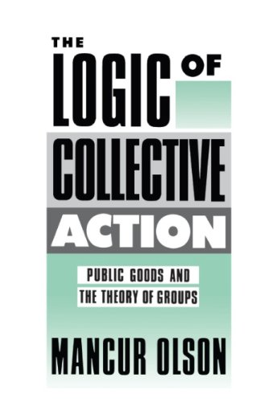{width=80% fig-align="center"}

:::

::: {.column width="60%"}
::: fragment
<br>
1. **The Puzzle**: Why do rational individuals join large social movements or vote when their single impact is near zero and costs are high?

2. The Research Question: 

- Do civic groups overcome free-rider incentives to mobilize mass political participation?

:::
:::

:::


## Example: Estamos Listas


<div style="position: relative; width: 90%; margin: auto; height: 800px;">
  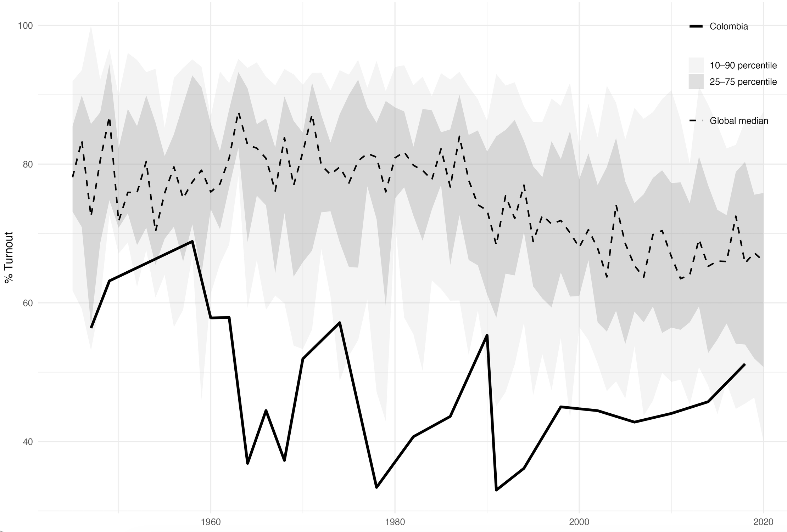
  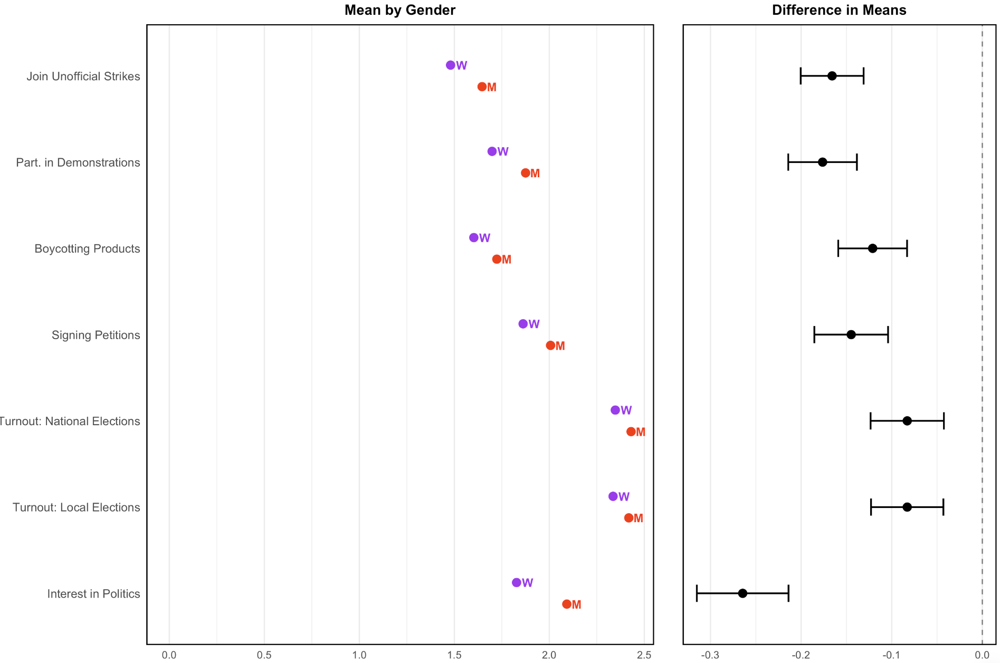
  
  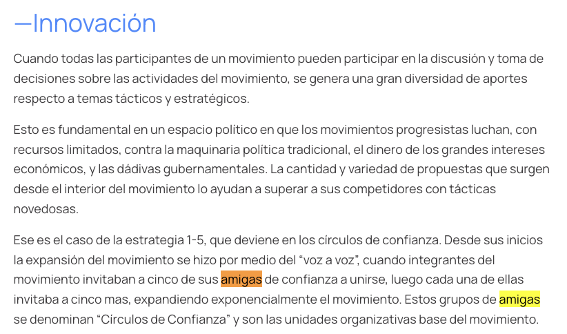
  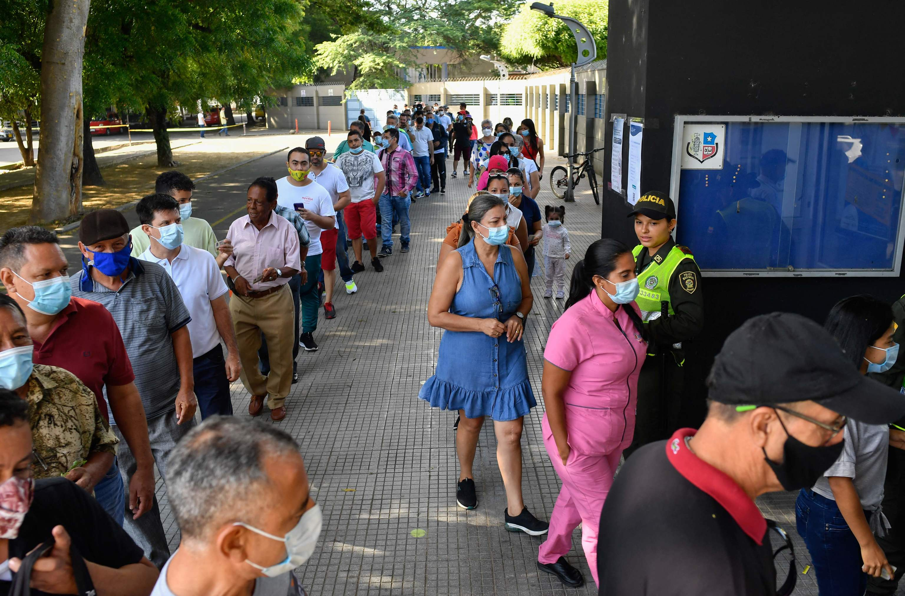
</div>


## The Ladder of Abstraction

Start from something maximally specific, then strip away detail one layer at a time: 

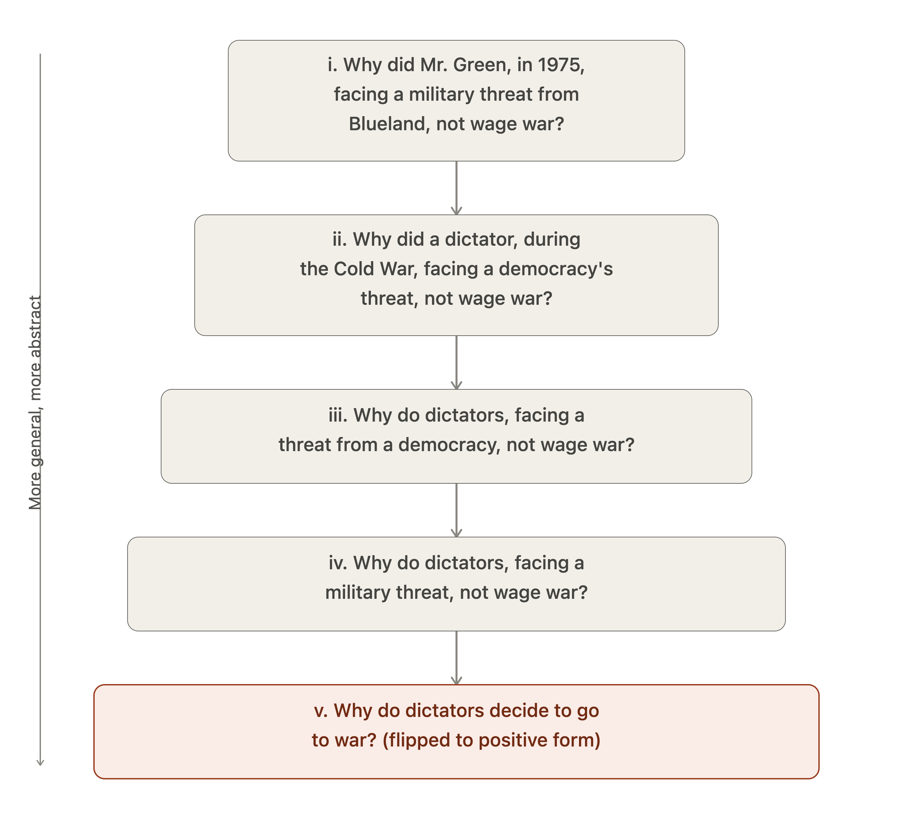{width=70% fig-align="center"}


## Worked Example A: A Question That Works

**"How does a midterm recession affect presidential economic policy?"** [How did Bidenomics change after the COVID-19 recession?]

:::small
- Studies *every* post-WWII US president who lived through a recession partway through their term, not just one president/recession

- Measures policy preference through the frequency of specific keywords in State of the Union speeches, before and after the recession

- This isolates the president's stated *preference* from the enacted policy (which needs Congress or the central bank's consent) and from the economic outcome itself (which depends on many non-political forces)
:::


## Worked Example B: A Question That Needs Work

**"How do disasters affect the birth rate?"**

:::small
- Sounds empirical and testable, but it's currently phrased around a **measure**, not a concept: what does "birth rate" actually stand for here? Population trends? A society's response to external threat?

- Which disasters: only natural ones, or man-made disasters like wars too? The answer depends entirely on the *theory* you haven't written yet

- If your mechanism is "people intuit the coming population loss and compensate," man-made disasters plausibly belong in the sample

- If your mechanism is religious or faith-based (a response to a deity-inflicted disaster), man-made disasters probably don't belong at all

- **Lesson**: you often can't finish specifying the question until you've sketched the theory as the two are not really sequential steps
:::

## Worked Example C

**"Why does the political left become social democratic in some Latin American countries and populist in others?"**

. . . 

::: small
- The geographic restriction here is *defensible*, not arbitrary. This specific form of populism was a Latin American phenomenon

- Restricting the sample to the region avoids the need to control for colonial history, prior authoritarian experience, and other background factors that would otherwise contaminate the comparison
:::

::: {.callout-note}
:::footnotesize
Any boundary you place on a *question* (geo, temp, whatever) has to be theoretically defensible. "I only care about this one case" is not a justification.
:::
:::


## Ten Ideal Types of Research Questions {.scrollable}

McCauley and Ruggeri (2020) classified IR questions into two families:

:::small
| # | Question form | Worked example |
|---|---|---|
| 1 | What is Y? | What is power? |
| 2 | How has Y changed? | How has trade increased over time? |
| 3 | Why Y? | Why war? |
| 4 | Under what conditions Y? | Under what conditions, peace? |
| 5 | Do Y and X covary? | Do democracy and peace correlate? |
| 6 | Does X cause Y? | **Do international organizations cause cooperation?** |
| 7 | What is the effect of X on Y? | **What is the effect of aid on civil war?** |
| 8 | Is the effect of X on Y moderated by Z? | **Is democracy's effect on war conditional on trade?** |
| 9 | Why does Y vary across groups/regions? | Why does cooperation vary across regions? |
| 10 | Why does X affect Y at one time but not another? | Why do alliances affect war risk differently over time? |
:::

## Sample research questions (APSR's last issues) {.scrollable}

::: small

- [What explains criminal governance's rise?](https://www.dropbox.com/scl/fi/qtm4yq9l2s0hv04o23xkj/Osorio.pdf?rlkey=9cyoa8eb9uwbn0sn2rxapvfiq&st=zmt5fjrf&dl=0) (Osorio & Brewer-Osorio) — *demand-supply criminal governance*
- [Can green policy fuel far-right gains?](https://www.dropbox.com/scl/fi/gl76lag9su5h4apvtzn32/Heddesheimer.pdf?rlkey=r11390651i5qp2o7f2iurr8z4&st=qmjt3zjn&dl=0) (Heddesheimer, Hilbig, Voeten) — *green transition backlash*
- [Do direct elections dislodge entrenched local elites?](https://www.dropbox.com/scl/fi/owelb1wlyz0sk9y31oeuy/Heinze.pdf?rlkey=6348yid3439x5j7opeuznj079&st=ej4tysd9&dl=0) (Heinze) — *elite capture persistence*
- Does minority-troop occupation trigger revenge violence? (Byun & Kwon) — *postbellum racial violence*
- Do gender quotas erode institutional legitimacy? (Clayton, O'Brien, Piscopo) — *quota democratic legitimacy*
- Does foreign media sway democratic voters? (Kao) — *authoritarian media influence*
- Why do minority autocracies survive longer? (Alsaadi) — *minority regime durability*

:::

## How Research Agendas Actually Evolve: Civil War

The civil war research agenda since the early 2000s:

::: small
1. **Start broad**: what explains variation in civil war onset? A flood of candidate Xs (GDP, ethnicity, natural resource shares, demographics) (Fearon & Laitin 2003; Collier & Hoeffler 2004)
:::

. . .

:::small
2. **Refocus on facets of Y**: not just *whether* war starts, but its duration, intensity, and violence against civilians (Kalyvas 2006) aka. inventing new dependent variables from an old one
:::

. . .

:::small
3. **Refocus the level of analysis**: from country-year to the dyad, the local community, (armed)group-level, the individual leader, following the "disaggregation" turn matching the empirics to the theory more precisely
:::

## Submit Your Own

## Scan to join
Open **[https://form.menti.com/s/alp9gx3rvbo9]** or scan the QR code.

*Write an empirical, causal research question*

{width=70% fig-align="center"}


#  {data-menu-title="Theories"}

::: section-heading
::: exercise
**Part 2: Theories**
:::
:::

## From Question to Theory

- A research question alone explains nothing: You need a **theory**, a set of logical arguments that try to tell us why political and social phenomena occur and how they relate to one another

- From the theory comes a **hypothesis**: the relationship you expect to observe, tested vs. a null hypothesis

- From the hypothesis comes an **observable implication**: what you would actually expect to find in real data if the theory is right

- Specifying the **mechanisms**: why should we observe this pattern, how do we get from X to Y and what are the observable traces of this link

## Theory: Definitions {.scrollable}

*A system of concepts and propositions (relationships between constructs/concepts) that, under certain assumptions and scope conditions, collectively present a logical, systematic, and coherent explanation of a phenomenon of interest.*

Bacharach, 1989

. . .

<br>

A good (empirical, not philosophical) theory therefore explains, more than it predicts or describes. Explanatory theories require understanding a cause and effect relationship:

* Correlation/association between two concepts
* Temporal sequence: the cause must precede the effect
* Causal thread: a mechanism linking cause to effect
* Definition and rejection of alternative hypotheses


## Types, purpose, and limits of theories {.scrollable}

::: panel-tabset

### Types

::: panel-tabset

#### Idiosyncratic

* Aim to explain a specific phenomenon or event
* A detailed, in depth explanation that may not have much external validity

#### Nomothetic

* Explanations generalizable across many contexts
* Relatively less precise, complete, or detailed
* More detail about the assumptions and observable implications across different contexts

:::

### Why they matter

* Understanding the nature of political and social phenomena
* Explaining observable patterns
* Making predictions about future observations
* Recommending public policy

**Without theories it would be difficult to have valid knowledge about political events, behaviors, and processes.**

### What theories are not

* **They are not paradigms.** A paradigm is a general framework or approach that defines a subdiscipline. Examples of paradigms: rational choice *theory*, systems *theory*, and so on.

* Social science theories are not immutable laws (water does not boil at 100°C by decree).

* They also do not apply to every context. Not even the best theories fully capture the complexity of social phenomena (see Moore's example).

* They are also not literature reviews, though reviews help define the question and the theoretical approaches.

:::

## Ingredients of a theory

::: columns
::: {.column width="60%"}

1. Presentation and definition of the concepts of interest

2. Relationship among the concepts and description of the assumptions and scope conditions

3. Description of the logical process (how it happens, to understand why) using specific cases or prior literature

4. Observable implications in the empirical context

5. Scope conditions (where does it *not* apply and why)

:::

::: {.column width="40%"}
<div style="position: relative; width: 99%; margin: auto; height: 800px;">
  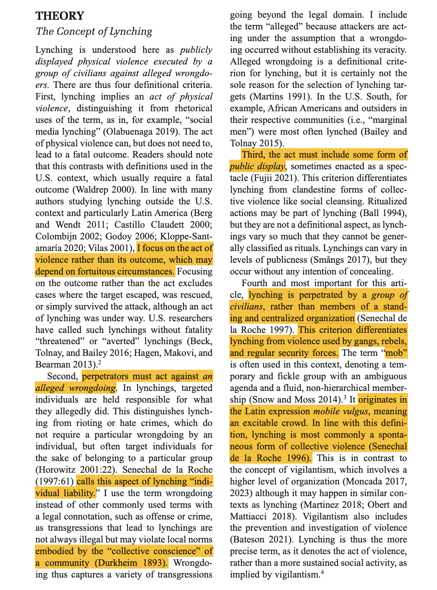
  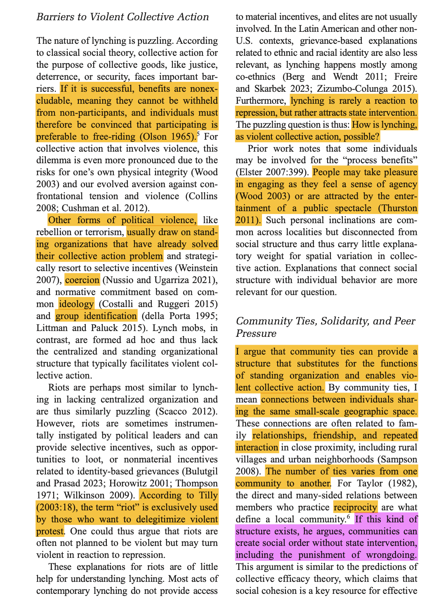
  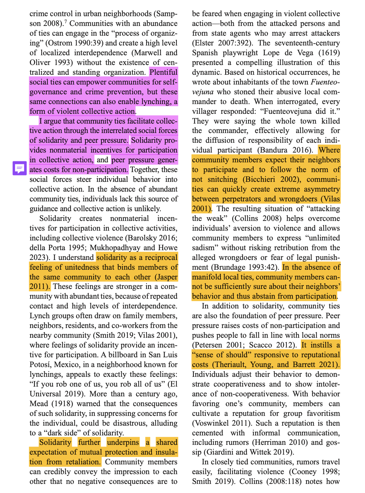
  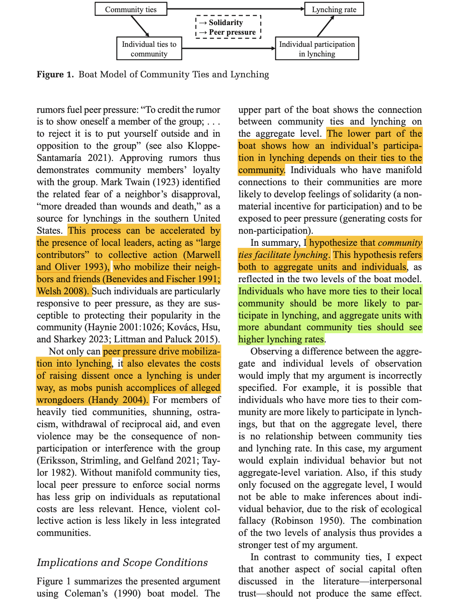
  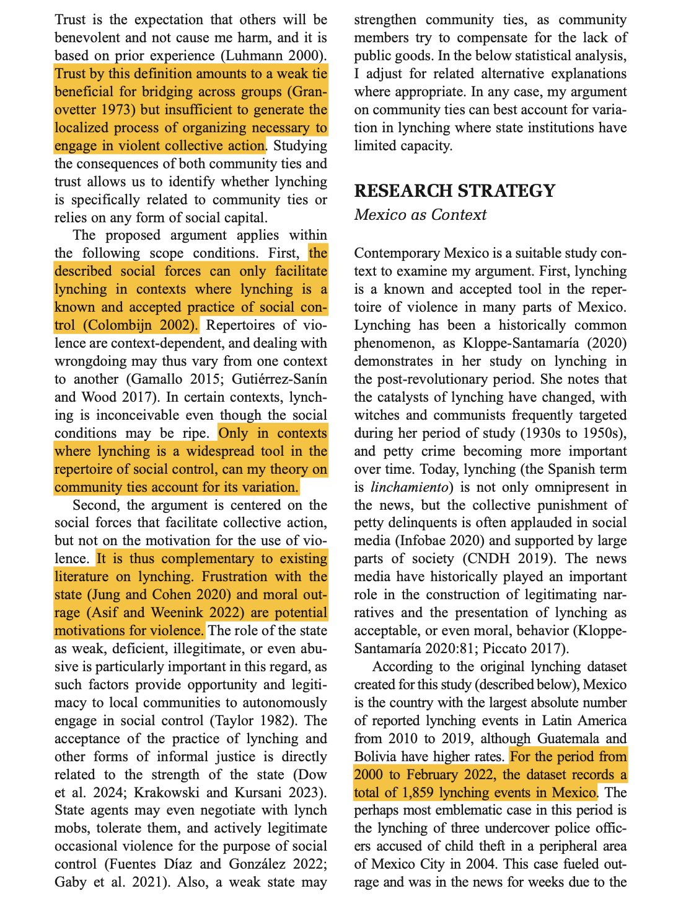
</div>
:::

:::

## Theory: Examples

::: panel-tabset

### Olson

::: columns
::: {.column width="69%"}
Mancur **Olson**, Jr. 1965, the theory of collective action.

1. Presentation and definition of the concepts of interest
2. Relationship among the concepts and description of the assumptions and scope conditions
3. Description of the logical process (how it happens, to understand why) using specific cases or prior literature
4. Observable implications in the empirical context
5. How this theory speaks to others
:::

::: {.column width="1%"}
:::

::: {.column width="30%"}
{width=99%}
:::
:::

### Kalyvas

::: columns
::: {.column width="69%"}
Stathis **Kalyvas** 2006, the logic of (selective) violence.

1. Presentation and definition of the concepts of interest
2. Relationship among the concepts and description of the assumptions and scope conditions
3. Description of the logical process (how it happens, to understand why) using specific cases or prior literature
4. Observable implications in the empirical context
5. How this theory speaks to others
:::

::: {.column width="1%"}
:::

::: {.column width="30%"}
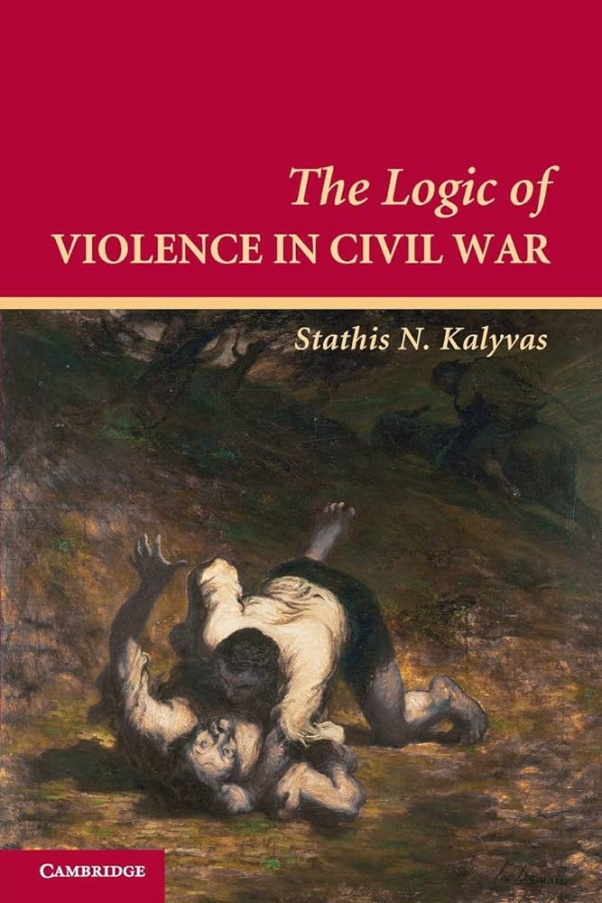{width=99%}
:::
:::

:::

## Kalyvas {.scrollable}

::: columns
::: {.column width="30%"}
::: small
Does anyone know why he became famous?

- Greek public opinion: it was not a civil war, it was a Nazi occupation

- Kalyvas: ??
:::

:::fragment
:::small
- Me: **How would you try to test/operationalize Kalyvas's argument?**
:::
:::
:::


::: {.column width="70%"}
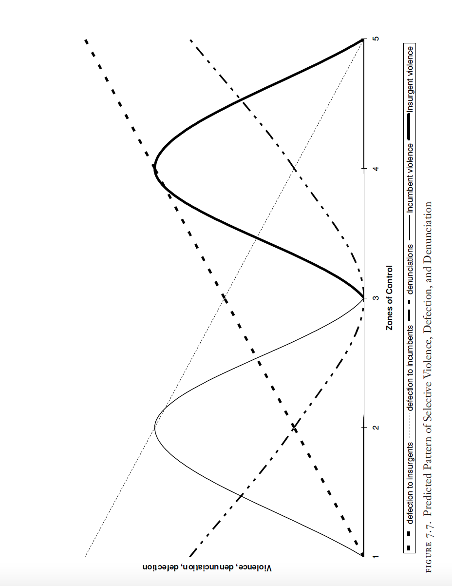{width=80%}
:::
:::


## Another Example: McGlendon (2013)

::: columns
::: {.column width="50%"}
<div style="position: relative; width: 99%; margin: auto; height: 800px;">
  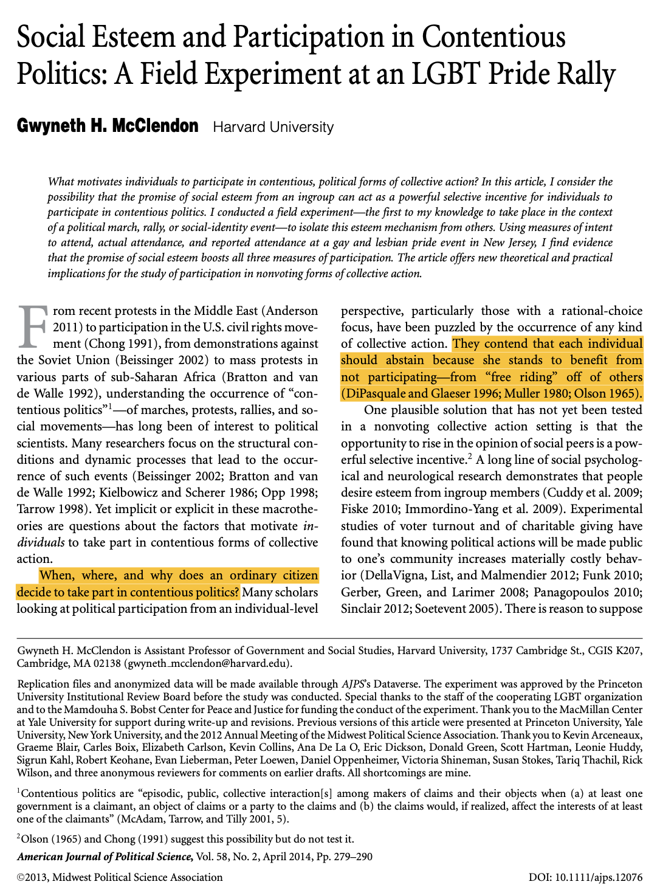
  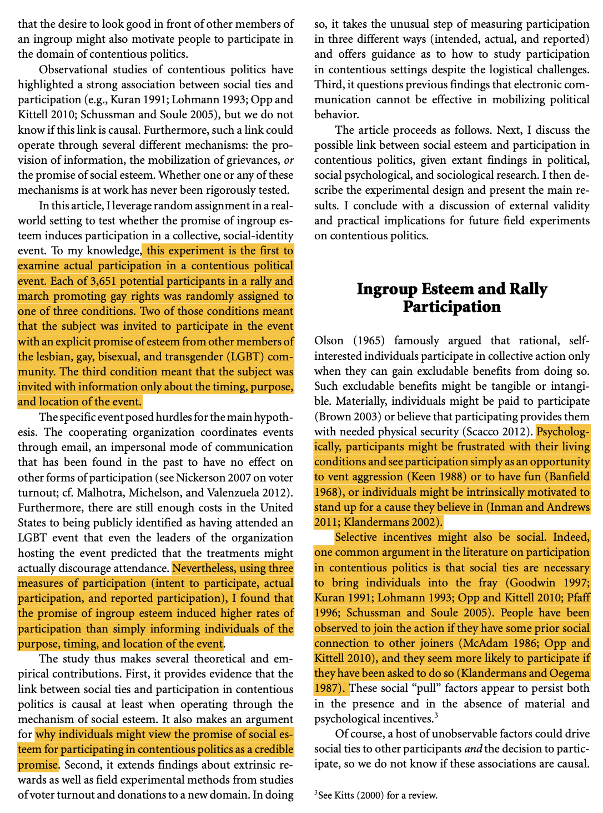
</div>
:::

::: {.column width="50%"}
<div style="position: relative; width: 99%; margin: auto; height: 800px;">
  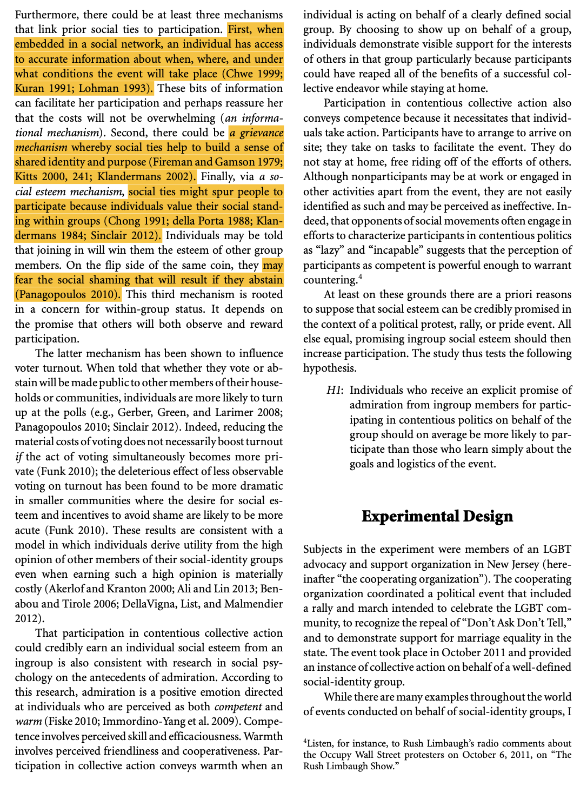
</div>
:::

:::

## Putting It Together

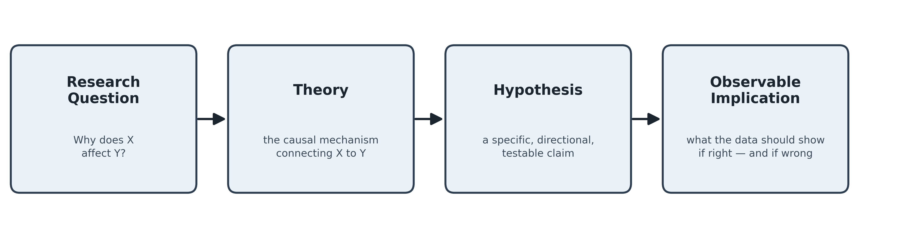{width=80% fig-align="center"}

- A hypothesis needs **direction**: "an increase in X leads to an increase in Y," not just "X matters somehow"

- An observable implication needs to be **falsifiable**: you must be able to say, in advance, what pattern in the data would count *against* your theory, not just what would support it


## Where to Start: Interrogate Existing Research

When you find a paper that genuinely interests you, run it through these questions:

::: small
- What other causes of the dependent variable did the previous researchers miss?

- Can their theory be applied somewhere else? a different region, time period, or level of analysis? 

- If we believe their findings, what further implications follow that they didn't test?

- How might this theory work at a different level of aggregation? Does an individual-level mechanism scale up to explain a country-level pattern, or vice versa?

- Would the mechanism survive being challenged by a rival discipline's assumptions?
:::


## Coming up

**Monday, Sept 21 — Seminar 2**: 

::: small
- Samii, C. (2023). *Methodologies for “Political Science as Problem Solving”*. In Oxford Handbook of Engaged Methodological Pluralism in Political Science. Oxford University Press.

- Read the introduction of: Bush, S. S., & Clayton, A. (2023). *Facing change: Gender and climate change attitudes worldwide*. American Political Science Review, 117(2), 591–608.
:::

**Friday, Sept 25 — Lecture 3**: From shoe-leather to experimental approaches

::: small
- Treisman, D. (2020). *Democracy by mistake: How the errors of autocrats trigger transitions to freer government*. American Political Science Review, 114(3), 792–810.

- Dunning, T., et al. (2019). *Voter information campaigns and political accountability: Cumulative findings from a preregistered meta-analysis of coordinated trials*. Science Advances, 5(7), eaaw2612.

:::

## Questions? {.center}
```{css}
.center h2 {
  text-align: center;
}
```

I'm also here: smsoler\@clio.uc3m.es
