---
format:
  revealjs:
    code-fold: true
    echo: true
    theme: custom.scss
    width: 1600
    height: 900
    navigation-mode: vertical
    controls-layout: edges
    controls-tutorial: true
    callout-appearance: default
    slide-number: c/t
    footer: "Research Seminar"
    logo: "logo.png"
    self-contained: true
    chalkboard: false
---

#  {text-align="center" data-menu-title="Introduction"}

```{r}
#| echo: false
library(tidyverse)
library(fontawesome)
library(crayon)
library(knitr)
library(ggthemes)
library(kableExtra)
library(directlabels)
library(ggtext)
library(plotly)
library(showtext)
library(countrycode)
library(readxl)
library(gt)
library(gtExtras)
library(countdown)
library(here)

knitr::knit_hooks$set(crop = knitr::hook_pdfcrop)
```

<br><br><br><br>

::: title
Research Seminar
:::

::: subtitle
Week 3: From shoe-leather to experimental approaches
:::

::: author
Sergi Martínez
:::

<br><br><br><br>

::: media
`r fontawesome::fa(name = "envelope", fill = "#2A363B")` [smsoler\@clio.uc3m.es]{style="color:#1DA1F2"} \| `r fontawesome::fa(name = "clock", fill = "#2A363B")` [Office hours: Tuesdays 10:00–13:00 (by email)]{style="color:#2A363B"}
:::


## Where are we

- We've learnt how to ask

- We've learnt how to motivate our readers to continue reading

- We will learn how to write good literature reviews and theory sections next Monday


#  {data-menu-title="Shoe-leather"}

::: section-heading
::: exercise
**Shoe-leather**
:::
:::

## Armchair

::: columns

::: {.column width="50%"}
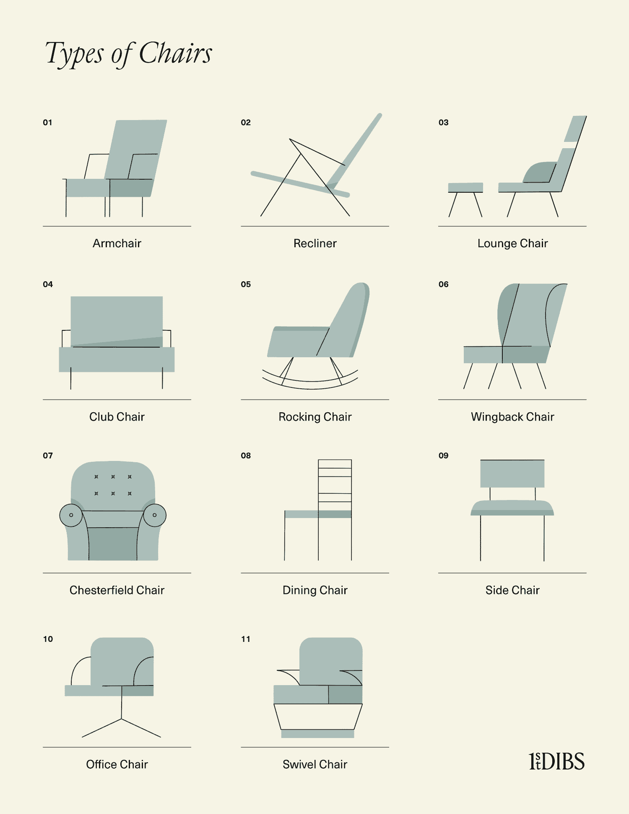{width=75% fig-align="center"}

:::

::: {.column width="50%"}

<br>

**Armchair research**: inquiry method that relies on existing literature, logic, and speculation without gathering new empirical data

- Meaning: Studying a topic from an "armchair" by reading or thinking instead of doing fieldwork

:::

:::

## Old times: Armchair critic

<div style="position: relative; width: 75%; margin: auto; height: 800px;">
  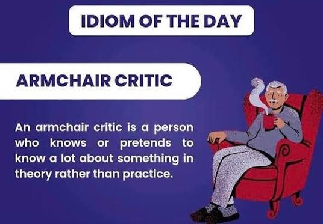
  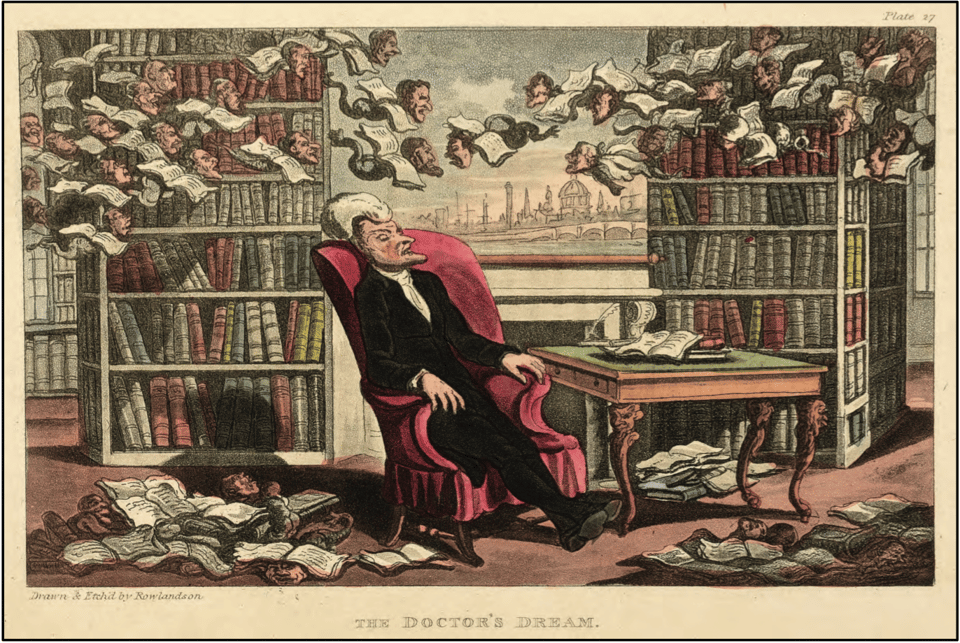
  
</div>


## Nowadays: armchAIr research

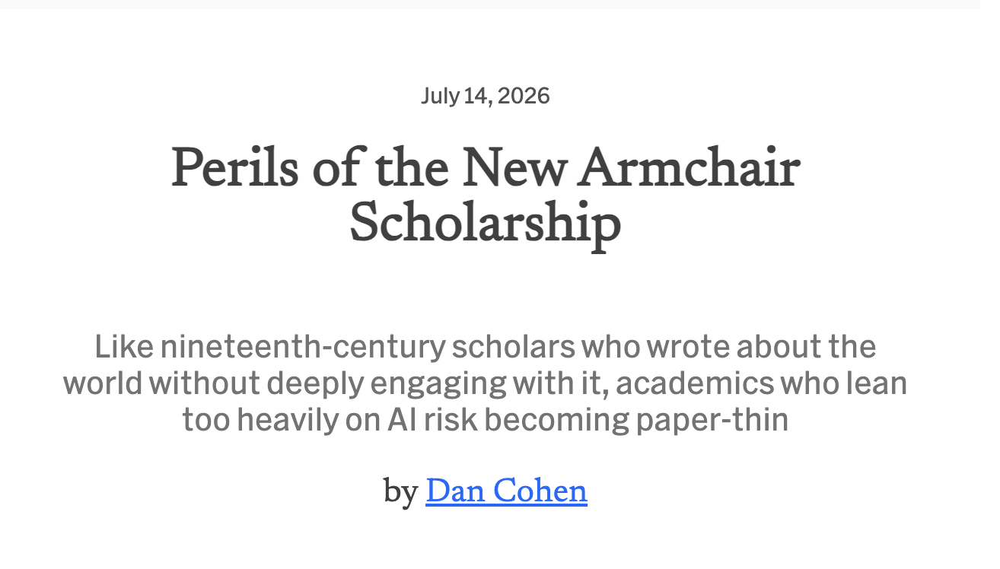{width=70% fig-align="center"}

::: small
For a lengthier discussion, see <https://newsletter.dancohen.org/archive/perils-of-the-new-armchair-scholarship/>
:::

## AI biases

- Learns from existing material at the web

  - Most of which is western centered
  
  - Most of theories and empirical approaches stem from majoritarian voices and overused arguments
  
  - Reproduces historical inequalities and biases [problem solving research?]

- 'People pleasing'

- Hallucinations

## Against armchAIr research: Shoe leather approaches

::: columns

::: {.column width="60%"}

**Shoe-leather**: Doing research with care, effort and attention to details through on-the-ground empirical research, including:

- Quantitative data analysis of originally collected data

- Qualitative fieldwork with field interviews, direct observation, and door-to-door inquiry

::: fragment
**vs.** 

**Solely on remote statistical modeling or secondary data**
:::

:::

::: {.column width="40%"}

<br>

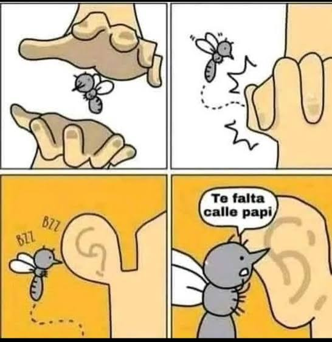{width=80% fig-align="center"}

:::

:::


## An example: Lake et al. 

::: columns
::: {.column width="50%"}
<div style="position: relative; width: 90%; margin: auto; height: 800px;">
  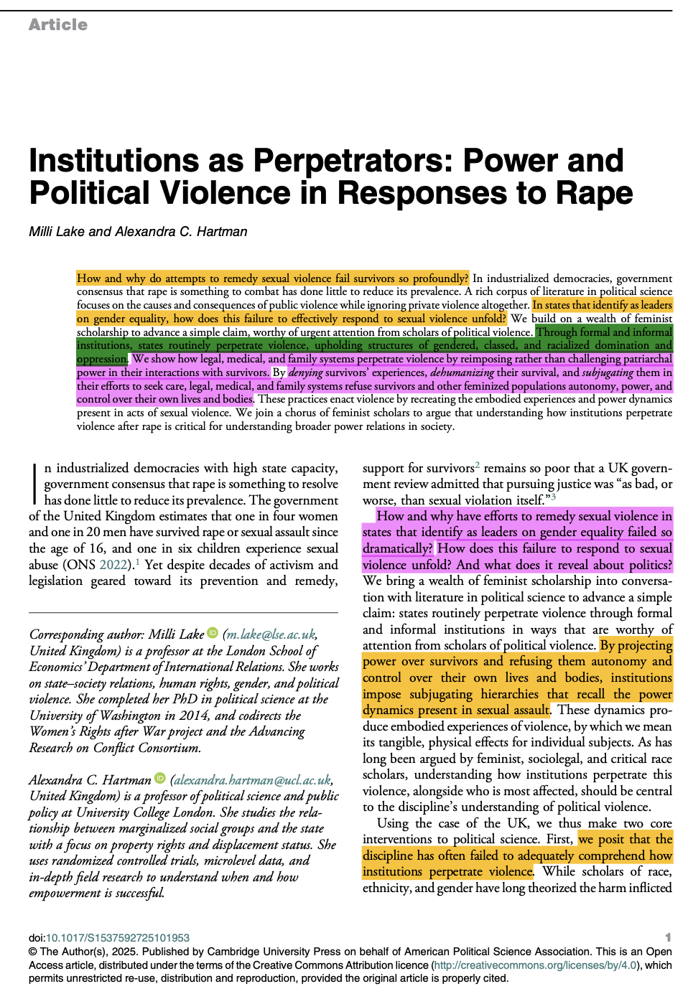
  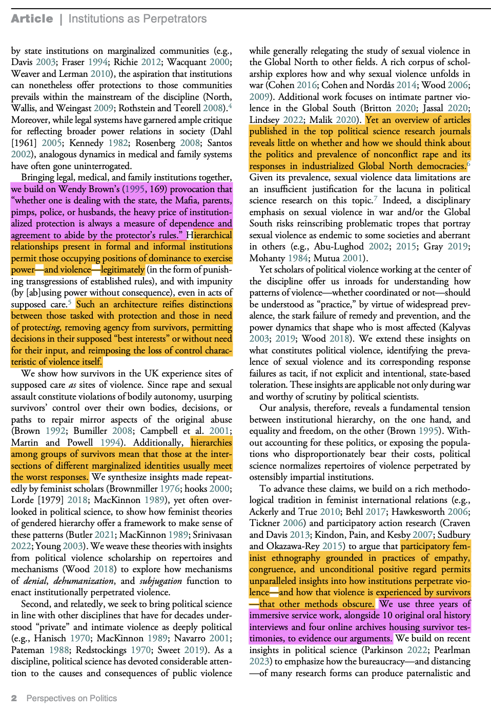
  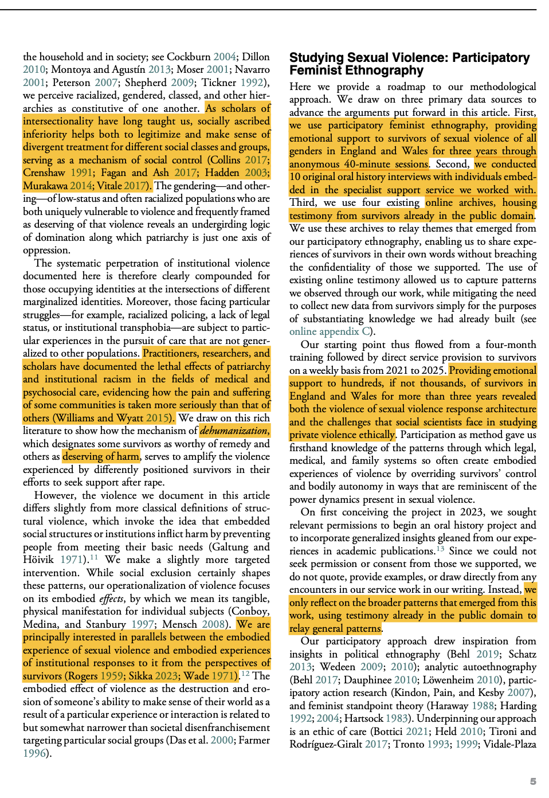
</div>
:::

::: {.column width="50%"}
<div style="position: relative; width: 90%; margin: auto; height: 800px;">
  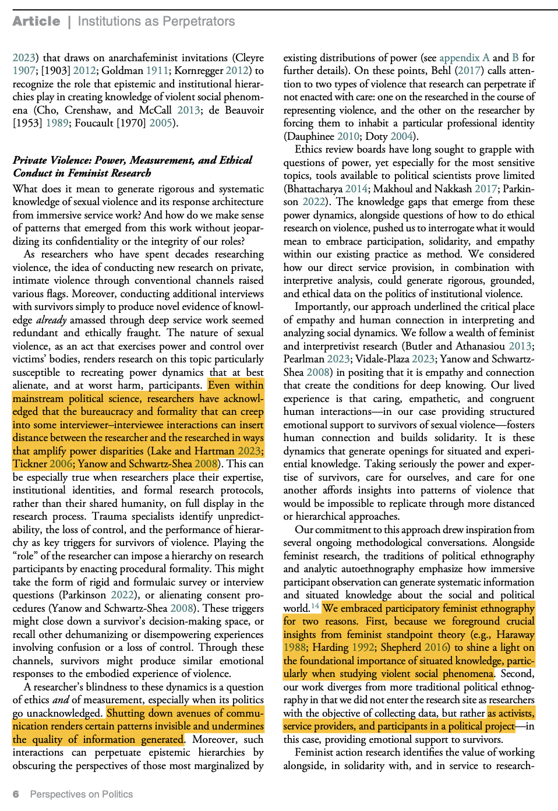
  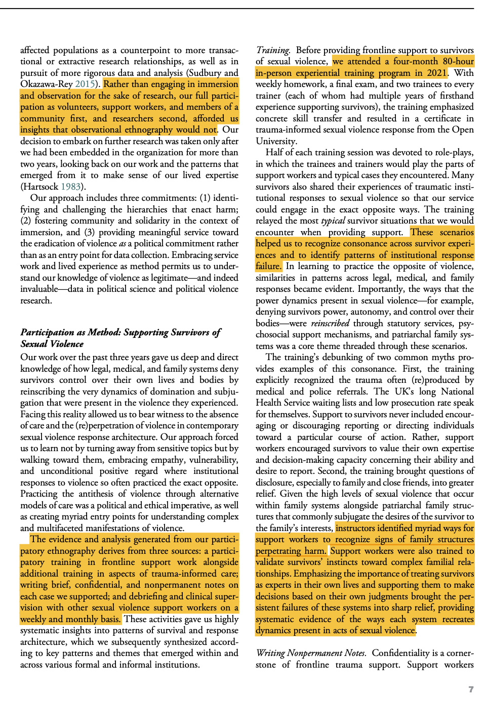
  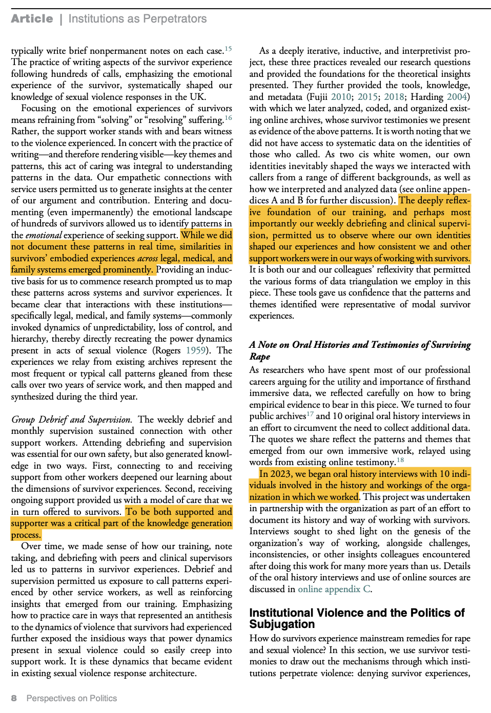
</div>
:::

:::

## Another example: Heinze

::: columns
::: {.column width="50%"}
<div style="position: relative; width: 90%; margin: auto; height: 800px;">
  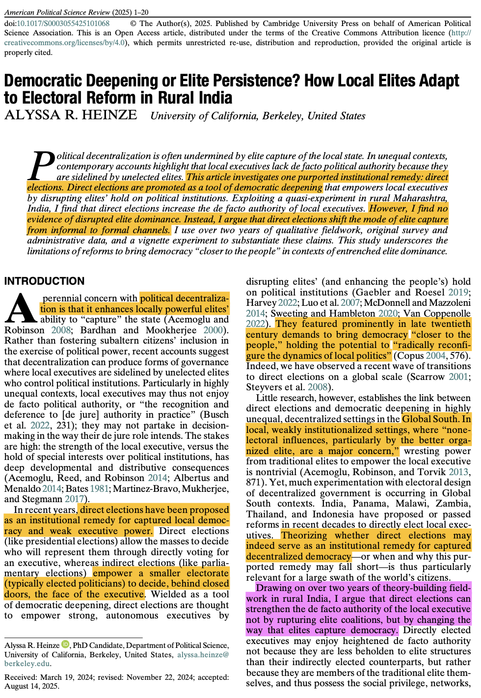
</div>
:::

::: {.column width="50%"}
<div style="position: relative; width: 90%; margin: auto; height: 800px;">
  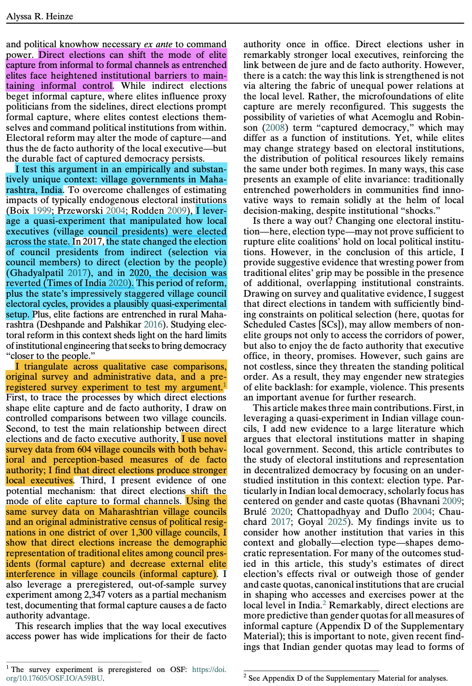
</div>
:::

:::


## Let's recap {.scrollable}

What's the question in each of these two papers? and the answer?

. . .

**Heinze**: 

. . .

::: small
- Question: Do direct elections reduce elite power? 

- Answer: No (quantitative) because elites switch to informal power
:::
. . .

**Lake and Hartman**:

. . .

::: small

- Question: How and why do state remedies for victims of sexual violence fail survivors needs and expectations?

- Answer: States are gendered, classed, racialized, and oppressive institutions. Lelgal, medical, and family systems reimpose patriarchal power in their interaction with survivors. 

:::

**Remember** that we are interested in empirical (V), causal questions (X → Y), and mechanisms (how and why X shapes Y).

::: small

We need both types of evidence. 

- Qualitative will inform about the case, the sequence, and how X affects Y (mechanisms)

- Quantitative will assess to what extent X and Y are associated

:::

<!-- Ideas: 

What's the type of question we have, how the different types of questions may complement each other in one single project.

What and how questions (descriptive, mechanistical) lean toward qualitative methods to inform about the case, to describe it, to explain the sequence of events and causes, and to draw on the mechanisms (how and why this cause actually shapes the effect). 

What's the effect, Does this cause this (causal) questions lean toward quantitative methods to inform to what extent both phenomena are associated, correlated.

They're complementary: the weaknesses of one represent the strength of the other. -->

#  {data-menu-title="RCTs"}

::: section-heading
::: exercise
**Experiments**
:::
:::

## How do we assess causality?

. . . 

Randomized controlled trials (RCTs): Type of statistical experiment that minimizes bias through the random allocation of participants to one or more comparison groups. 

::: small
- At least one group receives the intervention or process under study (a drug, surgical procedure, medical device or diet)

- The other groups receive an alternative treatment, a placebo, or standard care
:::

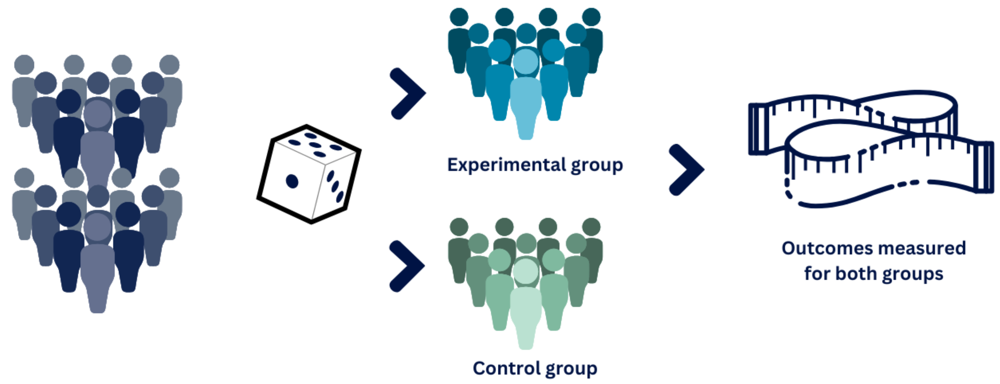{width=65% fig-align="center"}

## The logic of RCTs

If assignment to treatment is random

::: small

- T and C groups are expected to be similar in all respects except for the treatment (exchangeability)

- Any difference in outcomes between the two groups can be attributed to the treatment (causal effect)

:::


. . . 

Not observing both potential outcomes (Y(T), Y(C)):

::: small

- We can't estimate the causal effect for any individual (ITE)

- We estimate the average treatment effect (ATE) as the difference in mean outcomes between the two groups with a t-test

:::

## 

<div style="position: relative; width: 90%; margin: auto; height: 800px;">
  
  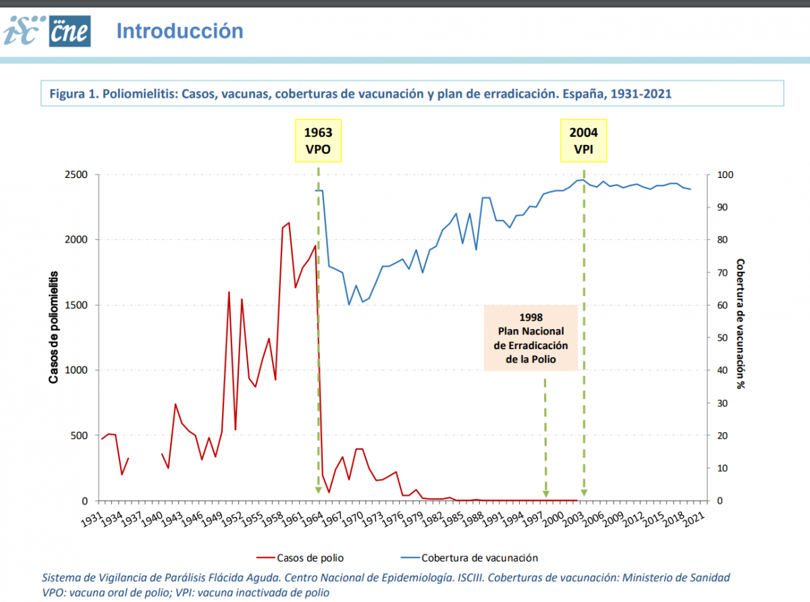
  
</div>

## Polio: The Salk vaccine trial



[Salk was not adored by everyone in science](https://www.youtube.com/watch?v=cym21dpmxL4)

## Can we do RCTs in political science?


Do you remember reading any? 

. . .

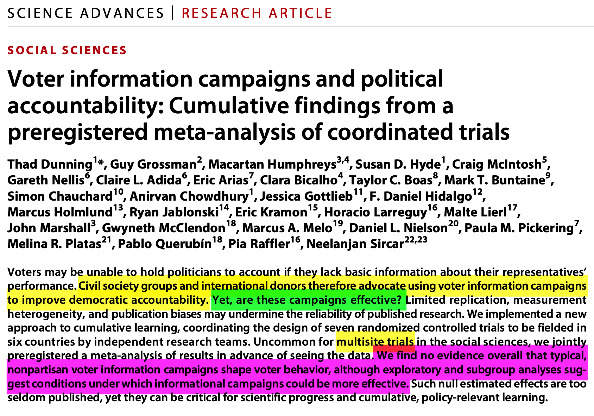{width=60% fig-align="center"}


## Metaketa


::: columns

::: {.column width="49%"}
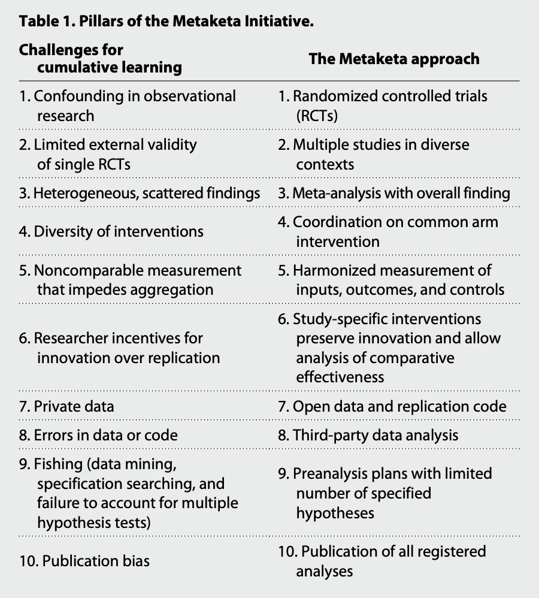{width=90% fig-align="center"}

:::

::: {.column width="49%"}


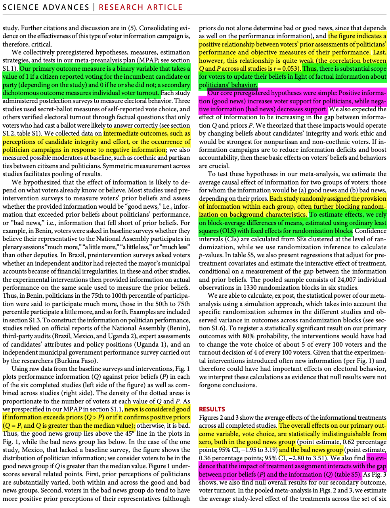{width=80% fig-align="center"}


:::


:::

## Metaketa: Null

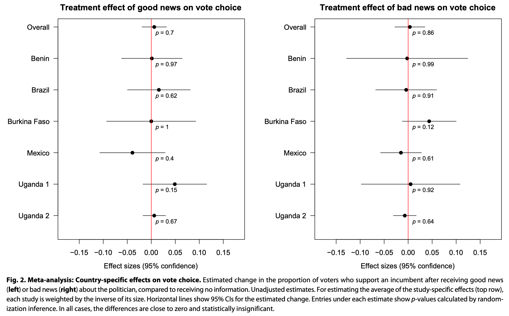{width=80% fig-align="center"}

## Metaketa: shoeleather?

And then? Do we learn anything from this null result? Why null?

. . .

What explains the weak overall effect on voter behavior of these common, potentially scalable informational interventions? 

::: small 
- There are many necessary steps in a causal chain linking information to voters’ decision-making process and, ultimately, to greater political accountability. In our studies, information existed and was disseminated.

- The extent to which voters understood the information varied markedly across studies, with nonresults in some studies suggesting real difficulties of disseminating information effectively

- Perhaps most critically, however, the information did not, on average, have any discernible effect on perceptions of politicians’ integrity and effort 

:::

## Null results {.scrollable}

. . .

::: small

- Can be as informative as significant results

- Null results are often the result of a complex causal chain, where the treatment is not enough to produce the expected effect

- Null results open the door to further research, to understand the mechanisms and conditions under which a treatment works or not

:::

. . .

::: small
**Problem**: Null results are often more difficult to publish(publication bias)

Evidence from a meta-experiment: Stegmann et al. (2022) [The null results penalty](https://cepr.org/voxeu/columns/null-result-penalty)

:::

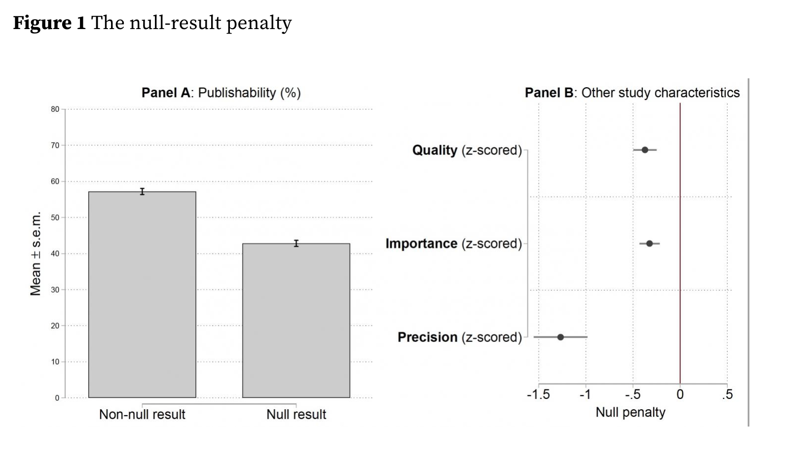{width=70% fig-align="center"}


## Meta-experiment?

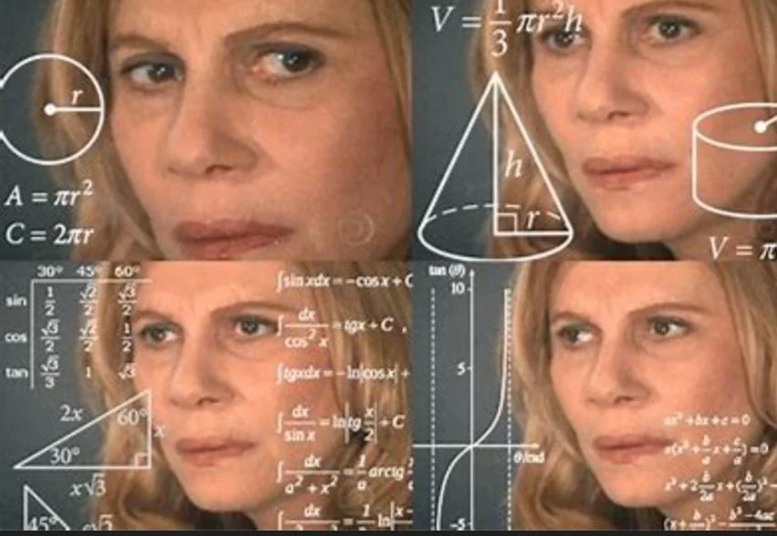{width=50% fig-align="center"}

## Experiments: From medical to social sciences

::: columns

::: {.column width="49%"}
**Medical**

::: small
- Randomization of different doses and components

- All human beings are very much equal in their biology, so we can expect similar effects across different populations

:::
:::

::: {.column width="49%"}
**Social**

::: small
- Doses and components rarely have linear effects

- Social phenomena are context-dependent, so we can expect different effects across different societies aka. scope conditions
:::

:::

:::

## Experiments in social sciences

## In political science...

::: columns

::: {.column width="49%"}
- We need to build on theory (observable implications)

- Adapt the design to the social context

- Evaluate the mechanisms that may affect the outcome of interest

- Discuss the scope conditions of the findings
:::

::: {.column width="49%"}
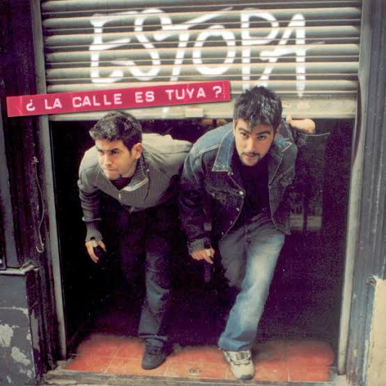{width=70% fig-align="center"}

:::

:::


## Example: Bursztyn et al. (2020) {.scrollable}

Pittsburgh, PA, USA, 2016: Donald Trump won the election with 44.2% of the vote

In 2018, survey to 1,600 registered voters, randomizing whether they received one of these two messages: 

::: small

- In the 2016 US Presidential Election, Donald Trump won Pittsburgh’s metropolitan area.

- In the 2016 US Presidential Election, Hillary Clinton won Pittsburgh’s county.
:::

Outcome: Donating money to a anti-immigration organization, but then there were two modes (randomized):

::: small
- **Public donation**: the donor's name and donation amount were published on a website

- **Private donation**: the donor's name and donation amount were not published on a website

:::

## Example: Bursztyn et al. (2020) Results {.scrollable}

. . .

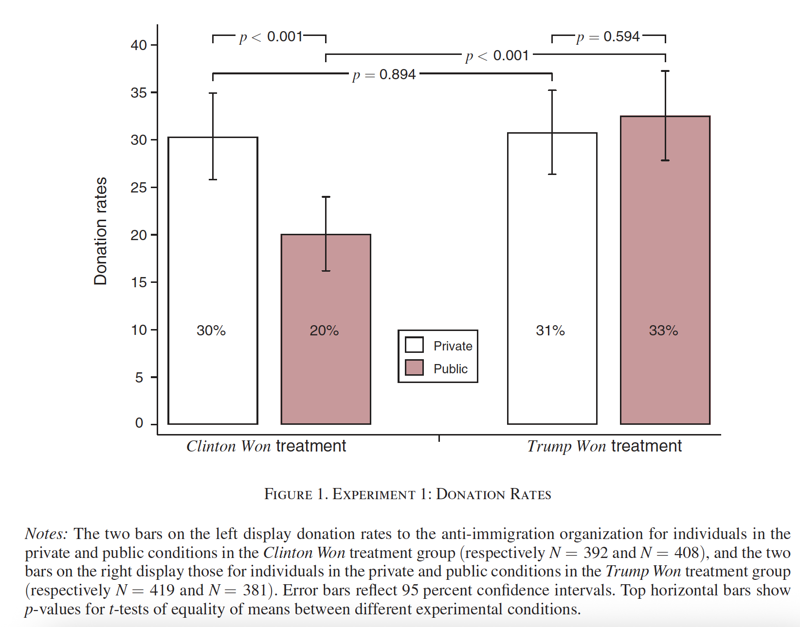{width=65% fig-align="center"}


## Like in medical sciences...

- We can´t randomize wars, institutions, social cohesion, identities, etc and we need to get to answers, most of the times, following a shoe-leather approach, with careful and detailed fieldwork





## Example: Treisman {.scrollable}

If traditional elites were so strong (economic, political, and military power), why did countries democratize?

- *It takes “the talents of specific individuals (virtù)” to defeat the vagaries of fortuna* (O’Donnell and Schmitter 1986)

- *~~Football~~ Autocracy is a game of mistakes, whoever makes the fewest ~~wins~~ survives* (Treisman 2020, from Cruyff)

. . .

Have you read Treisman's paper? What's the research method?

- Deductive and theory building

- Conceptual definition of *mistake* (non optimal choice, be them due to misinformation or miscalculation): *Democratization by mistake occurs if the regime becomes democratic because of one or more mistakes by the authoritarian incumbents* (p. 5)

- 3 paths to democracy: deliberate democratization, unavoidable democratization, and democratization by mistake. 

Democracy by mistake are those cases where autocrats' mistakes occur less than 3y before the democratization. 

## Treisman: What´s a mistake

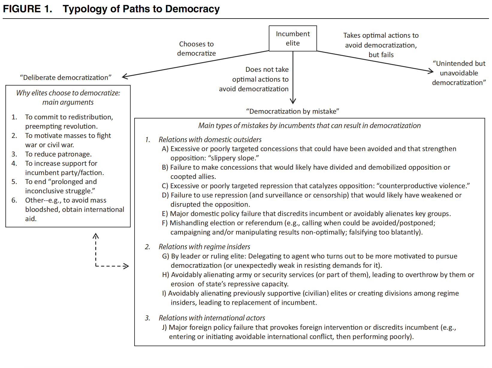{width=70% fig-align="center"}


## Treisman: A lesson for 

::: columns

::: {.column width="50%"}

::: small

- Conceptualization and operationalization of a weird concept: mistakes

- Careful and honest examination and classification of 270 cases of democratization

- Clear explanation of specific cases helping understand the main proposed mechanism, as well as alternative explanations 
:::

:::

::: {.column width="50%"}
<div style="position: relative; width: 90%; margin: auto; height: 800px;">
  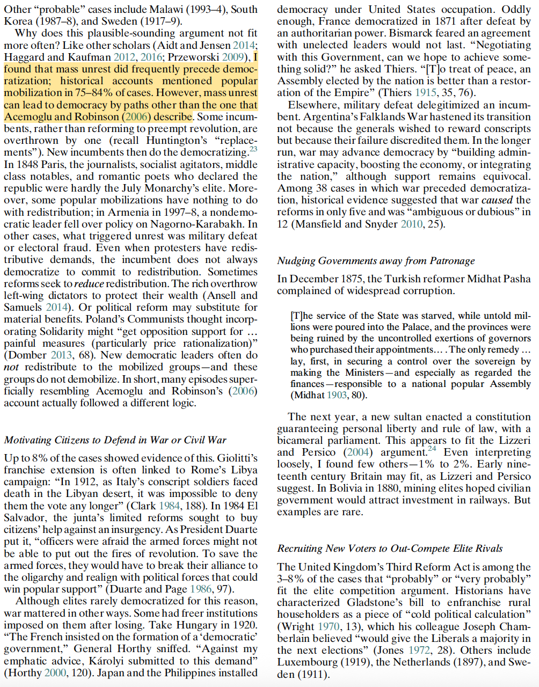
  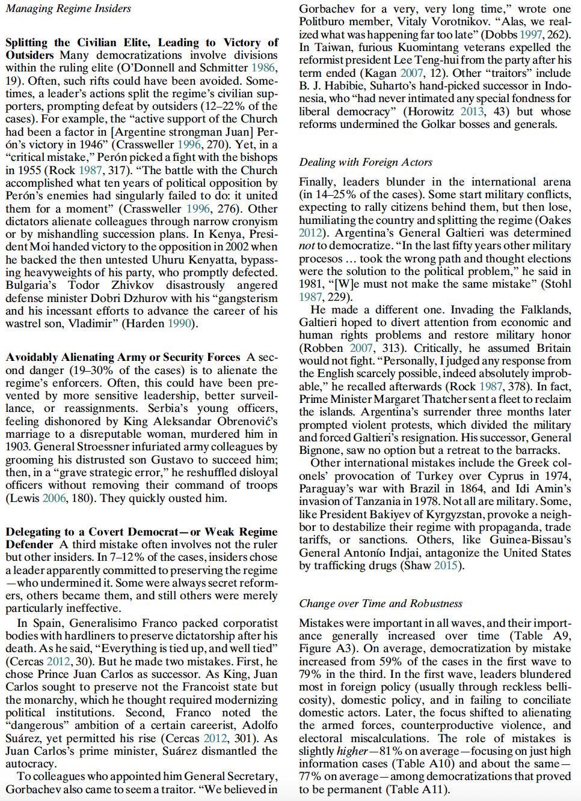
</div>
:::

:::


## Treisman: Its main mistake {.scrollable}

Is this a paper about the effects of causes or the causes of effects?

. . .

- All cases under study are democratizations, so the paper is about the causes of effects

- There's no variation in the dependent variable, which means we can't estimate the effect of X (mistakes) on Y (democratization). Why?

. . .

**We can't know if mistakes are equally present in non-democratizing countries**

**If non-democratizing countries also make mistakes, would you say they are a cause of democratization?**

. . .

That is selecting on the dependent variable
:::

<div style="position: relative; width: 60%; margin: auto; height: 800px;">
  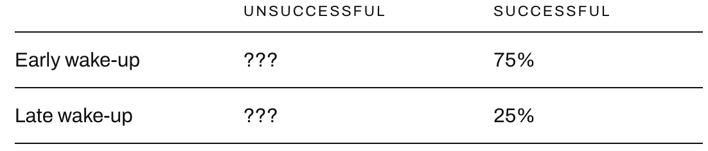
  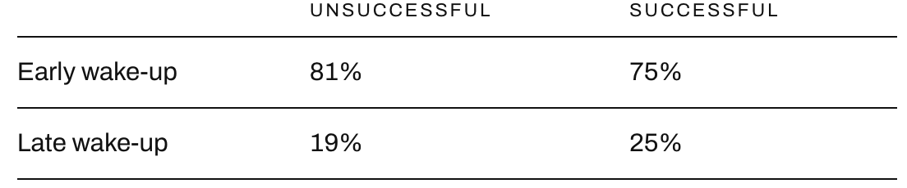
</div>

## Treisman: To remember {.scrollable}

::: small 
It is almost impossible to discuss history in causal terms without entertaining counterfactuals (Bunzl 2004; Tetlock and Belkin 1996). 

The question is rather how to distinguish “appropriate” or “grounded” counterfactuals from less pertinent ones. Some have suggested a few principles. 

- The mechanism should be consistent with well-established theoretical and empirical generalizations (theoretical and empirical consistency)

- The posited changes should be possible in isolation (feasibility of manipulation)

- It should be consistent with background conditions and mechanism (cotenability)

- With established facts about the historical setting (minimal rewriting)

- The counterfactual starting point and outcome should be isolation (feasibility of manipulation)

- Counterfactual starting point and outcome should be close together in time (temporal proximity) (Bunzl 2004; Fearon 1991; Levy 2015; Rohlfing 2012; Tetlock and Belkin 1996)

:::

## Coming up

**Monday, Sept 28 — Seminar 3**: 

::: small
- Read Lit and Theory sections: Goyal, T. (2023). Representation from below: How women’s grassroots party activism promotes equal political participation. American Political Science Review, 1–16.

- Read Intro, Concepts, Lit, Theory: Juon, A. (2025). The long-term consequences of power-sharing for ethnic salience. Journal of Peace Research, 62(3), 613–628.

:::

**Friday, Oct 2 — Lecture 4**: Causality, case-studies, and measurement. Visualization with R (ggplot).

::: small

- Fearon, J. D. (1991). Counterfactuals and hypothesis testing in political science. World Politics, 43(2), 169–195.

- Pager, D., & Quillian, L. (2005). Walking the talk? What employers say versus what they do. American Sociological Review, 70(3), 355–380.
:::

## Questions? {.center}
```{css}
.center h2 {
  text-align: center;
}
```

I'm also here: smsoler\@clio.uc3m.es
