---
format:
  revealjs:
    code-fold: true
    echo: true
    theme: custom.scss
    width: 1600
    height: 900
    navigation-mode: vertical
    controls-layout: edges
    controls-tutorial: true
    callout-appearance: default
    slide-number: c/t
    footer: "Research Seminar"
    logo: "logo.png"
    self-contained: true
    chalkboard: false
project:
  type: website
  output-dir: public
bibliography: bibliord.bib
---

#  {text-align="center" data-menu-title="Introduction"}

```{r}
#| echo: false
library(tidyverse)
library(fontawesome)
library(crayon)
library(knitr)
library(ggthemes)
library(kableExtra)
library(directlabels)
library(ggtext)
library(plotly)
library(showtext)
library(countrycode)
library(readxl)
library(gt)
library(gtExtras)
library(countdown)
library(here)

knitr::knit_hooks$set(crop = knitr::hook_pdfcrop)
```

<br><br><br><br>

::: title
Research Seminar
:::

::: subtitle
Week 2: Seminar
:::

::: author
Sergi Martínez
:::

<br><br><br><br>

::: media
`r fontawesome::fa(name = "envelope", fill = "#2A363B")` [smsoler\@clio.uc3m.es]{style="color:#1DA1F2"} \| `r fontawesome::fa(name = "clock", fill = "#2A363B")` [Office hours: Tuesdays 10:00–13:00 (by email)]{style="color:#2A363B"}
:::

## How seminars work {.scrollable}

::: small

- 11 sessions across the semester, combining:

  - Critical discussion of the assigned readings

  - Presentation of your group project

  - Applied practice in R: in class execution of hands-on exercises

:::

. . .

Two components of your grade come directly from this room (a part from the development of the group-project):

::: small

- **Group critical presentation** (10%): each group presents and critically evaluates one assigned article, in the week it's assigned — 15'

- **Three critical questions** (10%): across the semester, each of you must raise at least three critically informed questions about the papers or the seminar content

:::

## Questions? {.center}


## Today {.scrollable}


- LaCour, M. J., & Green, D. P. (2014). *When contact changes minds: An experiment on transmission of support for gay equality*. Science, 346(6215), 1366-1369

- The rest

- Broockman, D., & Kalla, J. (2016). *Durably reducing transphobia: A field experiment on door-to-door canvassing*. Science, 352(6282), 220–224

- Discussion on other cases

## LaCour & Green (2014) {.scrollable}


::: columns

::: {.column width="65%"}
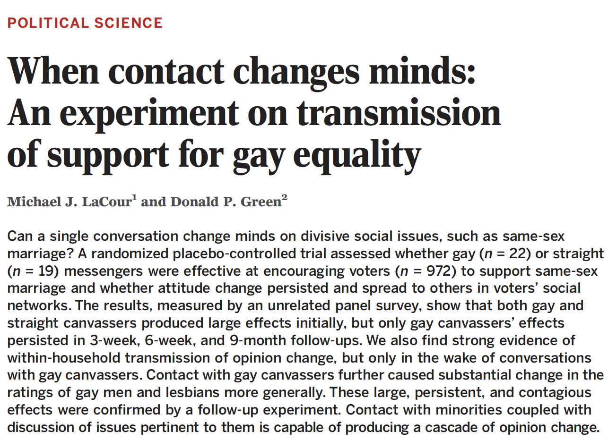{width=98% fig-align="center"}

:::

::: {.column width="34%"}

<br>

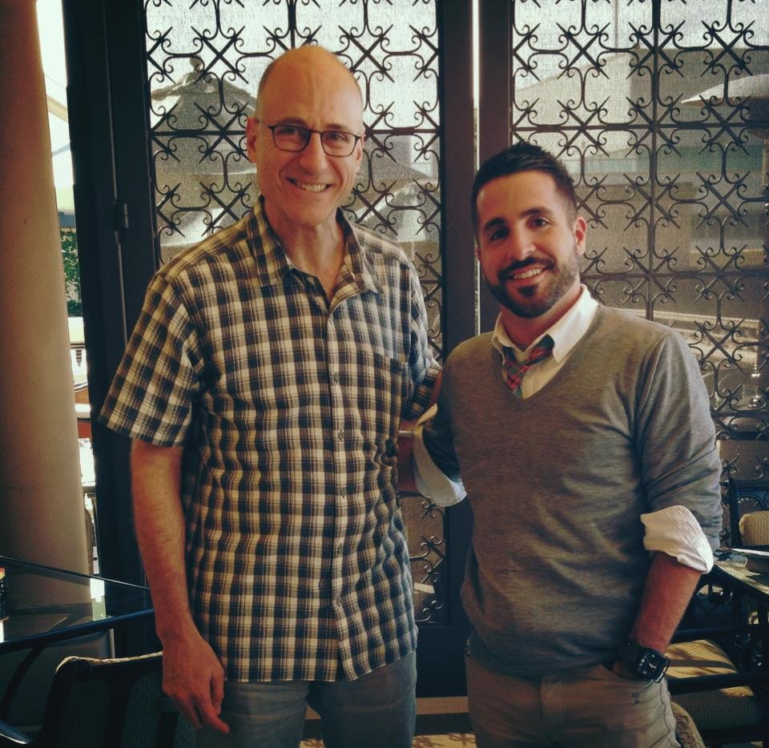{width=99% fig-align="center"}


:::


:::

## LaCour & Green (2014): Research question and theory {.scrollable}

<!-- Add the abstract/graphical summary image here, e.g.:
{width=60% fig-align="center"} -->

**Research question**: Does hearing strangers' opinion change one's views? 

- Can a single conversation change minds on a divisive social issue? Does that change last?

. . .

**Theory**

- Contact hypothesis (Allport, 1954): intergroup hostility diminishes when members of different groups interact. Meta-analytic work confirms contact reduces prejudice across many outgroups (Pettigrew & Tropp, 2006).

. . .

**Their contribution**: a distinction between two kinds of contact

- *Passive contact*: Personal exposure to an *outgroup* member (e.g., through shared activity)
- *Active contact*: Exposure **plus** a conversation about the very issue that divides the two groups

. . .

**Hypothesis**: active contact (a canvasser who discloses their own stake in the issue) produces larger and more durable attitude change than passive contact or messaging alone.


## LaCour & Green (2014): Context, design, and data {.scrollable}

::: columns

::: {.column width="60%"}

::: small
**Context**: Southern Cal, + ban same-sex marriage in 2008


**Participants**: registered in an online panel (multiple waves, bef-aft) survey (outcomes = items about opinion on SSM) of 972 voters


**Design**: door-to-door **field experiment**, **random** assignment at the household level to five conditions:

:::

::: tiny
- **REAL TREATMENT** Same-sex marriage script, delivered by a **gay** canvasser
- Same-sex marriage script, delivered by a **straight** canvasser
- Recycling script (pl), delivered by a gay canvasser
- Recycling script (pl), delivered by a straight canvasser
- C: No-contact
:::

:::


::: {.column width="40%"}

<br>

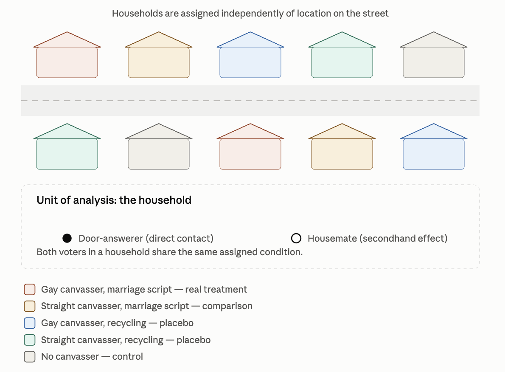{width=99% fig-align="center"}

:::

:::

## LaCour & Green (2014): Main results and conclusion {.scrollable}

::: columns

::: {.column width="60%"}
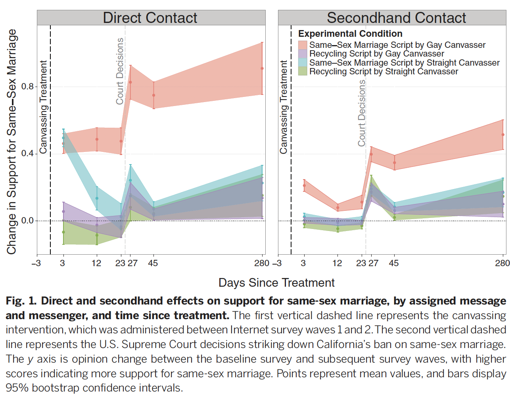{width=99% fig-align="center"}

:::

::: {.column width="39%"}

:::small 

After random assignment, differences between groups are associated with the treatment, so we just compare groups: 

- Canvassers produced similar short-run gains in support

- Straight-canvasser's effects mostly faded 

- **Gay-canvasser effects persisted and grew**
:::
:::

:::

## What do we like? Critiques? {.center}

## The finding that made headlines {.scrollable}

Conclusion or **headline**: 

- A conversation (outgroup contact + disclosure and discussion of the very issue at stake) -> can produce persistent and even contagious shifts in people's support for same-sex marriage

. . .

- Covered by *This American Life*, the *NYT*, the *WSJ*, the *Washington Post*, *Vox*, and more — a dream result, and a dream case for teaching field experiments


## The unraveling {.scrollable}


::: columns

::: {.column width="60%"}

::: small

While preparing their own extension, Broockman, Kalla, and Peter Aronow (Yale) tried to reconstruct LaCour's dataset and kept hitting inconsistencies


- They documented **eight statistical irregularities**, none conclusive alone, but jointly pointing the same way

- Their report's conclusion, in careful academic language: the data *"were not collected as described"*


- They brought it to Donald Green, the senior co-author, who confronted LaCour, who confessed to fabricating the data

- Green requested the retraction himself; *Science* retracted the paper in May 2015

:::

:::

::: {.column width="39%"}

<br>

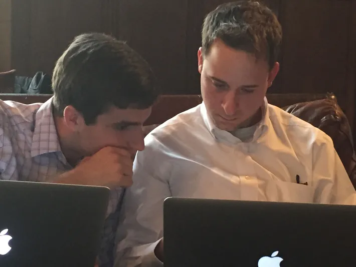{width=99% fig-align="center"}

:::

:::


## From scandal to science {.scrollable}

Retracting a paper doesn't answer the underlying question, it just leaves it open again

. . .

- Broockman & Kalla went on to run the study properly themselves: real door-to-door canvassing in Miami, this time on **transphobia**, with a placebo topic (recycling) as the control conversation

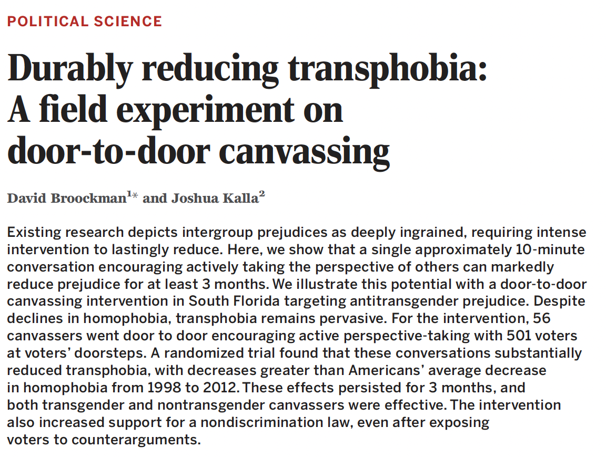{width=65% fig-align="center"}

- Result: durable reductions in prejudice

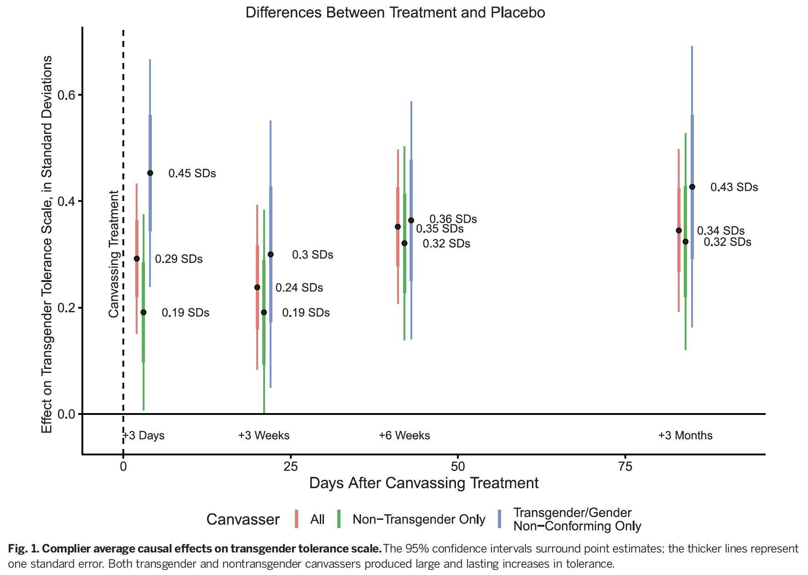{width=65% fig-align="center"}


## 

::: small
*"Science advances incrementally,"* a fabricated shortcut doesn't survive; a slow, careful, replicable design does
:::




## Fabrication is uncommon

::: columns

::: {.column width="49%"}
{width=80% fig-align="center"}

:::

::: {.column width="49%"}


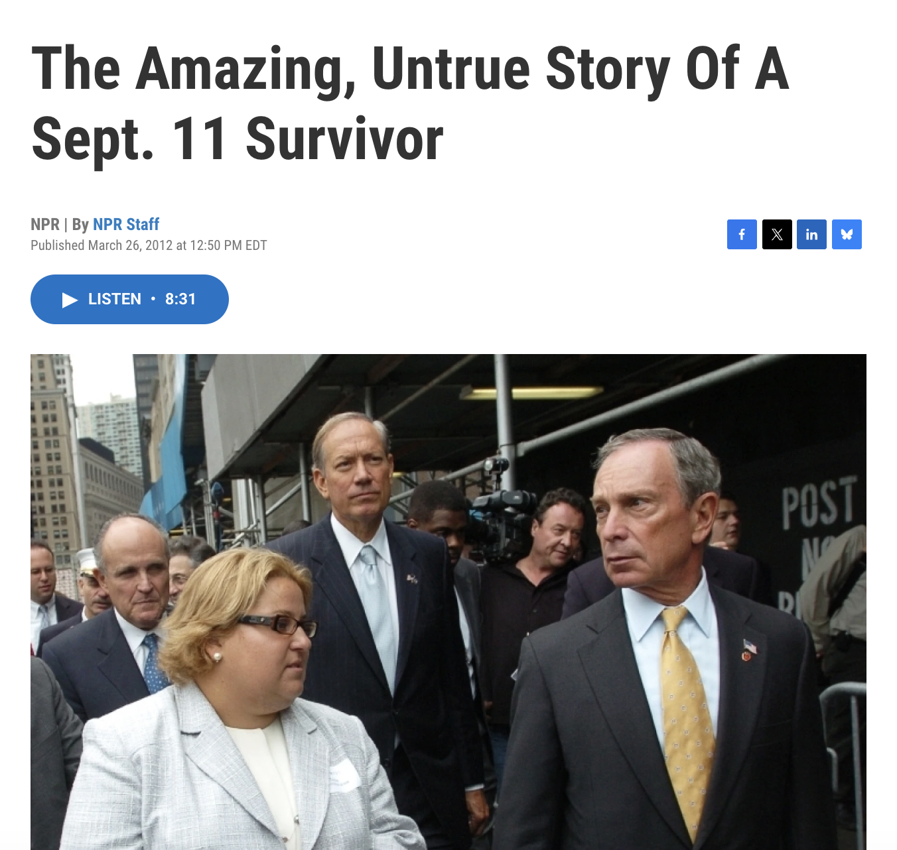{width=80% fig-align="center"}


:::


:::

## Fishing expeditions {.scrollable}

Fabrication is the extreme case. Far more common, and much harder to spot, is **fishing**:

{width=40% fig-align="center"}


## Fishing {.scrollable}

- Multiple comparisons testing many outcomes, subgroups, or specifications until one is significant

- One dataset can support many "reasonable" analysis choices; *which one gets published?*

- HARKing — Hypothesizing After the Results are Known, then writing the paper as if the hypothesis came first

. . .

Each of these inflates the rate of false positives, without anyone needing to fabricate a single number.

## Instrumental inclusiveness

::: {layout-ncol=1}
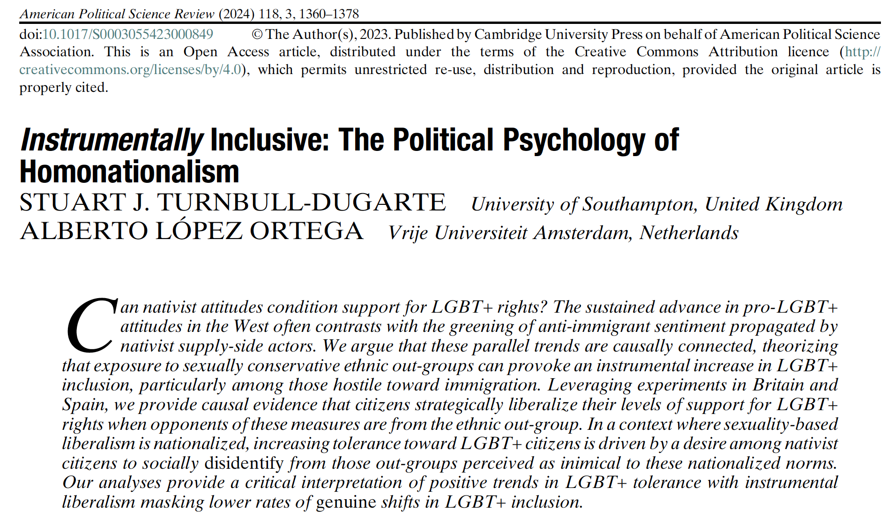{width=80% fig-align="center"}

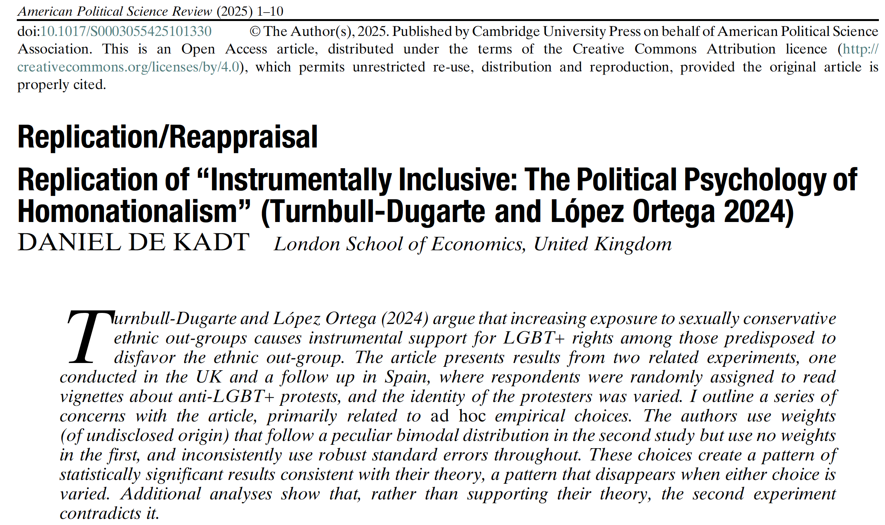{width=80% fig-align="center"}

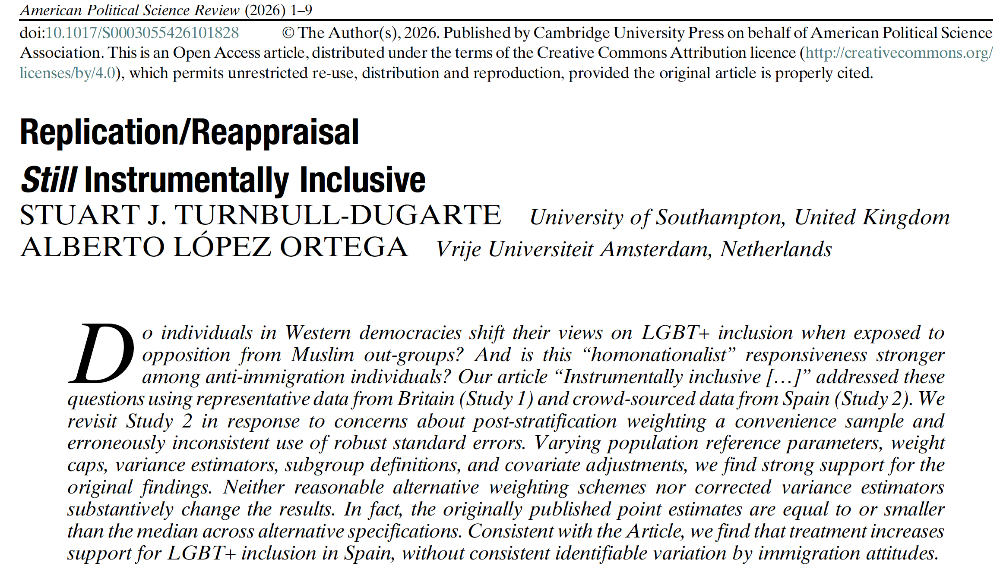{width=80% fig-align="center"}
:::

## The limits of "the" scientific method, applied to social reality {.scrollable}

::: small

Political and social phenomena resist the clean version of the scientific method you may associate with a lab:

:::

- Most treatments of interest can't be randomly assigned (a war, an institution, an identity)

- Confounding is the default, not the exception, in observational data

- Context matters: an effect found in one setting may not travel to another (external validity)

- The subjects are reflexive aka. people react to being studied, to incentives, to the researcher

. . .

This is part of why the 2010s brought a **replication crisis** across psychology, economics, and political science, and why our field now leans harder on pre-registered (inductive and empirical) experiments (causal), transparency, and replication (reproducible)

## Safeguards for this semester {.scrollable}

::: small

- Cite properly every idea or text you use must be attributed (APA, for instance)

- Share your data and code reproducibility is the point of the R workshops later this semester

- AI tools are a powerful aid for help with code, structure clarity, **not** for writing from scratch or finding references because the machine made it all up

:::

. . .

<br>

**Any hallucinated citations or evidence, or any form of plagiarism — AI-generated or otherwise — is evaluated with a grade of zero.**

## Group formation

We'll use today's session to: 

1. Form your project groups

2. Set the rota for the group critical presentations across the semester

## Looking ahead

**Friday, Sept 18 — Lecture 2**: The research process I: from the question to hypotheses.

<br>

**Monday, Sept 21 — Seminar**: Motivation and research questions. Read Cyrus Samii's blog and identify three societal problems — we'll discuss how to turn them into research questions.

## See you Friday! smsoler\@clio.uc3m.es {.center}
```{css}
.center h2 {
  text-align: center;
}
```
