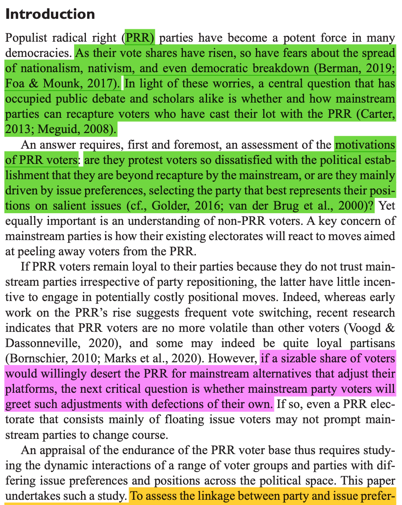
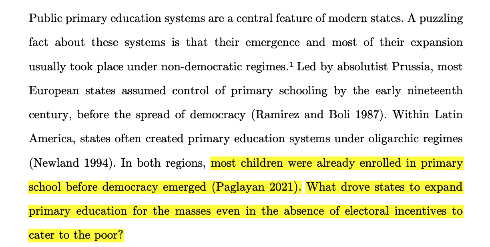
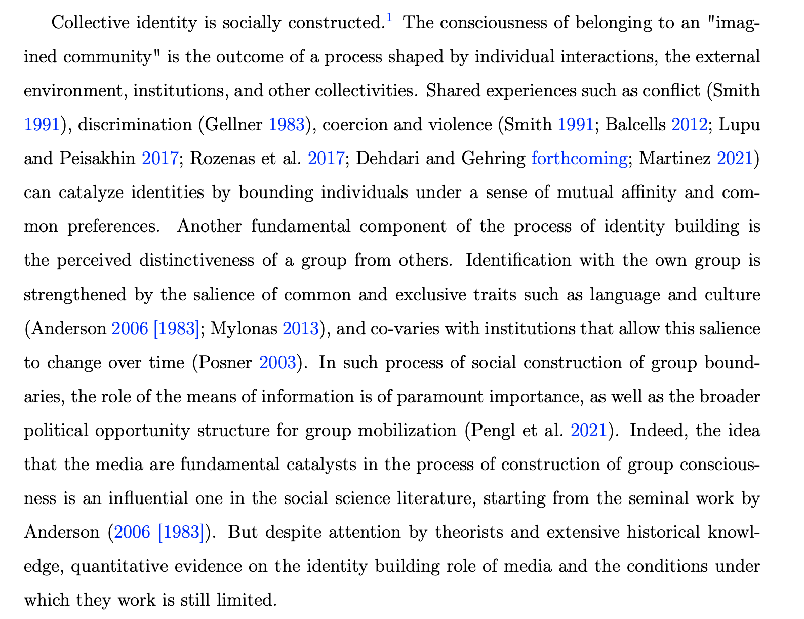
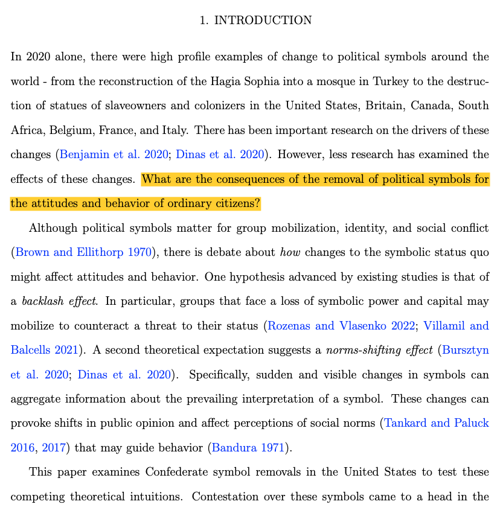
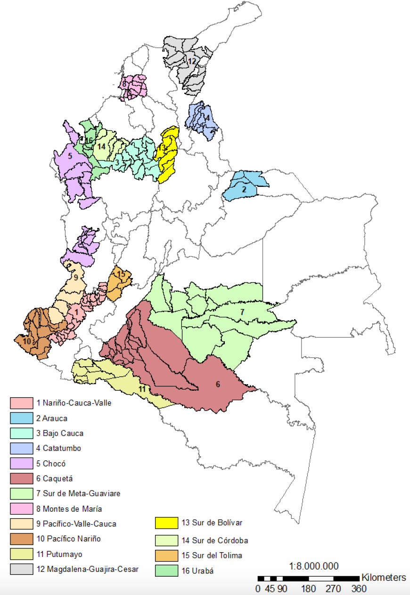
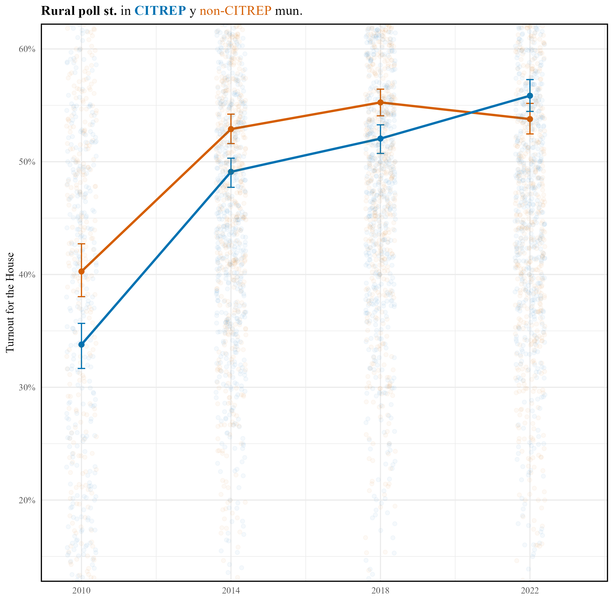
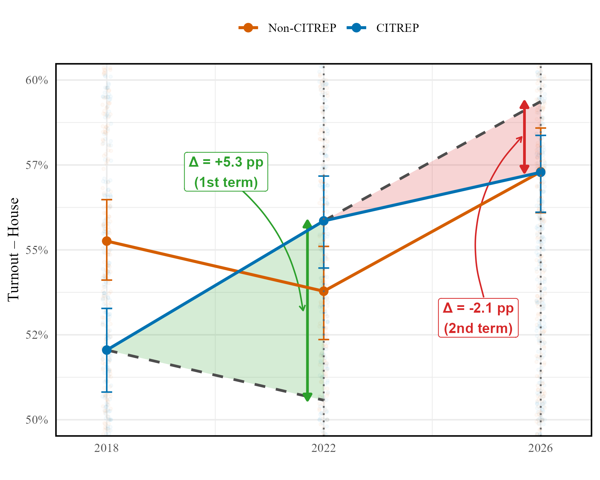
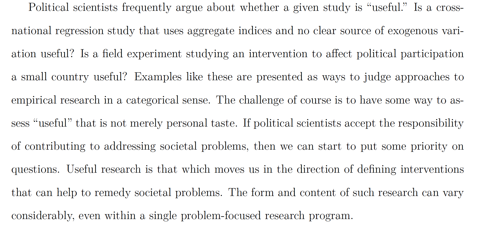
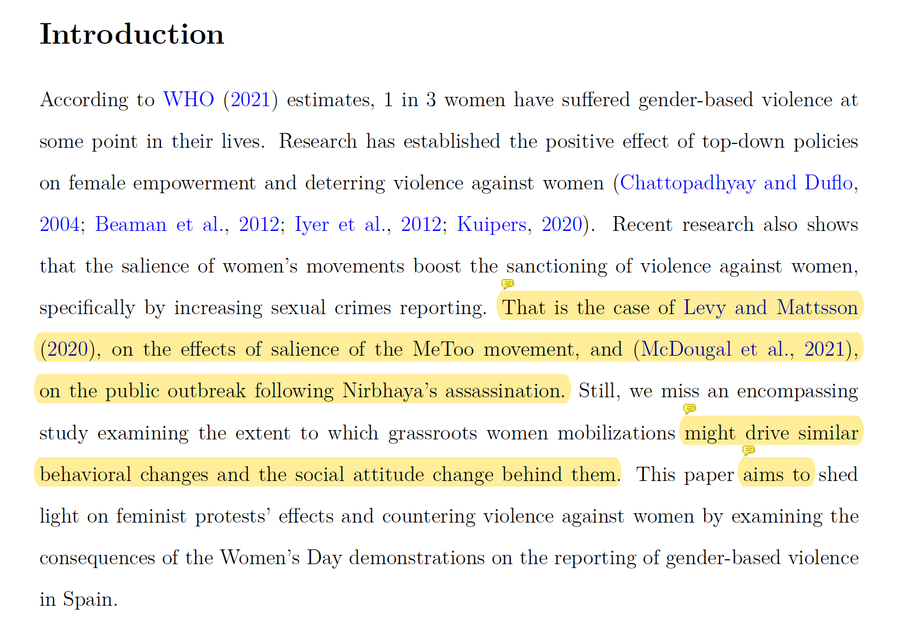

---
format:
  revealjs:
    code-fold: true
    echo: true
    theme: custom.scss
    width: 1600
    height: 900
    navigation-mode: vertical
    controls-layout: edges
    controls-tutorial: true
    callout-appearance: default
    slide-number: c/t
    footer: "Research Seminar"
    logo: "logo.png"
    self-contained: true
    chalkboard: false
project:
  type: website
  output-dir: public
bibliography: bibliord.bib
---

#  {text-align="center" data-menu-title="Introduction"}

```{r}
#| echo: false
library(tidyverse)
library(fontawesome)
library(crayon)
library(knitr)
library(ggthemes)
library(kableExtra)
library(directlabels)
library(ggtext)
library(plotly)
library(showtext)
library(countrycode)
library(readxl)
library(gt)
library(gtExtras)
library(countdown)
library(here)

knitr::knit_hooks$set(crop = knitr::hook_pdfcrop)
```

<br><br><br><br>

::: title
Research Seminar
:::

::: subtitle
Week 3: Seminar
:::

::: author
Sergi Martínez
:::

<br><br><br><br>

::: media
`r fontawesome::fa(name = "envelope", fill = "#2A363B")` [smsoler\@clio.uc3m.es]{style="color:#1DA1F2"} \| `r fontawesome::fa(name = "clock", fill = "#2A363B")` [Office hours: Tuesdays 10:00–13:00 (by email)]{style="color:#2A363B"}
:::

## Today {.scrollable}

Readings:

- Samii, C. (2023). *Methodologies for “Political Science as Problem Solving”*. In Oxford Handbook of Engaged Methodological Pluralism in Political Science. Oxford University Press.

- Read the introduction of: Bush, S. S., & Clayton, A. (2023). *Facing change: Gender and climate change attitudes worldwide*. American Political Science Review, 117(2), 591–608.

In class:

- Motivating strategies and problem-solving research

- Group presentation


##

**Motivation is fundamental in life**. Without it, we can do little. 

- What motivates you to continue reading a newspaper article?

. . .

- *What motivates you to continue reading an academic article* (after reading the abstract)?

. . . 

The added value (contribution) of the article framed from:

1. A theoretical **puzzle** it solves

2. The **gap** it fills in the lit

3. A **societal problem** that it faces


## Examples {.scrollable}

1. Chou et al. (2021) Comparative Political Studies. 

{width=70% fig-align="center"}

<br>

. . .

2. Paglayan (2023) American Political Science Review.


{width=70% fig-align="center"} 


<br>


. . .


3. Lemoli (2024) Comparative Political Studies. 
 
{width=70% fig-align="center"}

<br> 


. . .


4. Rahnama (2024) Journal of Politics. 

{width=70% fig-align="center"}


## How to start

An article's first paragraph is fundamental:

::: small

1. A theoretical **puzzle** it solves


*Not everything needs to be puzzling* (see Tom Pepinsky's post <https://tompepinsky.com/2019/02/07/on-puzzles-and-political-science/>)


2. The **gap** it fills in the lit

:::

. . .


3. A **societal problem** that it faces


## ¿What does Cyrus Samii say? {.scrollable}


{width=40% fig-align="center"}


## The problem-solving approach: Identify a problem {.scrollable}


1. Identify a normative problem. *`Reminding the social nature of social science research'*. ¿Example? CITREP


. . .

::: columns
::: {.column width="40%"}

{width=70% fig-align="center"}


:::

::: {.column width="60%"}

{width=99% fig-align="center"}


:::

:::

## The problem-solving approach: Root of the problem? {.scrollable}


::: columns
::: {.column width="35%"}

{width=90% fig-align="center"}


:::

::: {.column width="65%"}

::: small
2. Find the root of the problem to identify potential solutions

- Rural *forgotten* areas without representatives in institutions [vicious circle or representation and responsiveness] 

- *"They should leave Bogotá and come here"*

Solution? 


::: fragment
CITREP: Circunscripciones Transitorias Especiales de Paz

- A quota according to which every one of these districts would get one representative in the House

:::
:::

:::

:::

## The problem-solving approach: Policy evaluation

3. Evaluate the impact of solutions 

::: footnotesize
Full paper: Barceló, J., Martínez, S., & Vela, M. From Hope to Disillusionment: The Peace Seats and Democratic Integration in Postwar Colombia. Forthcoming, American Political Science Review. 
:::

. . .

::: columns
::: {.column width="50%"}

{width=75% fig-align="center"}


:::

::: {.column width="50%"}

::: fragment
{width=99% fig-align="center"}

:::

:::

:::


## Useful? Me? {.scrollable}

{width=80% fig-align="center"}

. . .

Example: 

{width=80% fig-align="center"}

## {.center}

- What do you think?

- Should we focus on fine tuning our *policies*? or on solving theoretical puzzles? 


## Hands on: Write the motivation for your question

::: small

- How are your research questions? 

- Write a motivational paragraph using at least one of these strategies to start our articles

- We will share them in 8' 

:::

## Looking ahead

**Friday, Sept 25 — Lecture 3**: From shoe-leather to experimental approaches

::: small
- Treisman, D. (2020). *Democracy by mistake: How the errors of autocrats trigger transitions to freer government*. American Political Science Review, 114(3), 792–810.

- Dunning, T., et al. (2019). *Voter information campaigns and political accountability: Cumulative findings from a preregistered meta-analysis of coordinated trials*. Science Advances, 5(7), eaaw2612.

:::


**Monday, Sept 28 — Seminar**: Lit vs. Theory. Prepare a brief, 5' presentation (no slides needed) about your motivation, question, lit. review, theory, and hypothesis. 

::: small

- Read Lit and Theory sections: Goyal, T. (2023). Representation from below: How women’s grassroots party activism promotes equal political participation. American Political Science Review, 1–16.

- Read Intro, Concepts, Lit, Theory: Juon, A. (2025). The long-term consequences of power-sharing for ethnic salience. Journal of Peace Research, 62(3), 613–628.
:::

## See you on Friday! Any question at smsoler\@clio.uc3m.es {.center}

