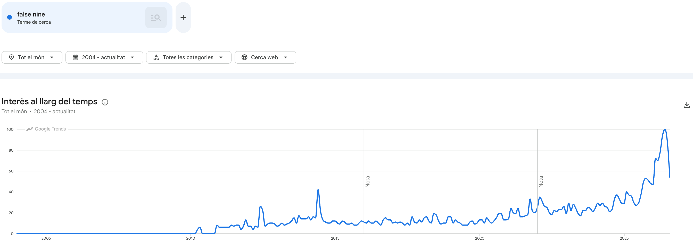
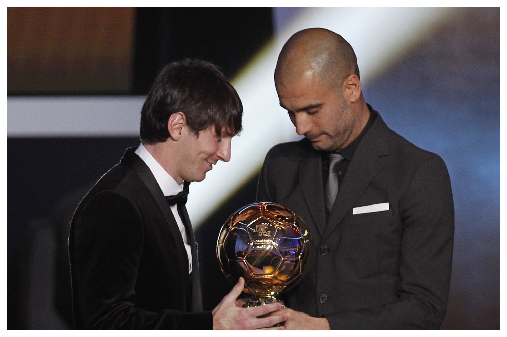

---
format:
  revealjs:
    code-fold: true
    echo: true
    theme: custom.scss
    width: 1600
    height: 900
    navigation-mode: vertical
    controls-layout: edges
    controls-tutorial: true
    callout-appearance: default
    slide-number: c/t
    footer: "Research Seminar"
    logo: "logo.png"
    self-contained: true
    chalkboard: false
---

#  {text-align="center" data-menu-title="Introduction"}

```{r}
#| echo: false
library(tidyverse)
library(fontawesome)
library(crayon)
library(knitr)
library(ggthemes)
library(kableExtra)
library(directlabels)
library(ggtext)
library(plotly)
library(showtext)
library(countrycode)
library(readxl)
library(gt)
library(gtExtras)
library(countdown)
library(here)

knitr::knit_hooks$set(crop = knitr::hook_pdfcrop)
```

<br><br><br><br>

::: title
Research Seminar
:::

::: subtitle
Week 4: Seminar
:::

::: author
Sergi Martínez
:::

<br><br><br><br>

::: media
`r fontawesome::fa(name = "envelope", fill = "#2A363B")` [smsoler\@clio.uc3m.es]{style="color:#1DA1F2"} \| `r fontawesome::fa(name = "clock", fill = "#2A363B")` [Office hours: Tuesdays 10:00–13:00 (by email)]{style="color:#2A363B"}
:::

## Today {.scrollable}

Readings:

- Read Lit and Theory sections: Goyal, T. (2023). Representation from below: How women’s grassroots party activism promotes equal political participation. American Political Science Review, 1–16.

- Read Intro, Concepts, Lit, Theory: Juon, A. (2025). The long-term consequences of power-sharing for ethnic salience. Journal of Peace Research, 62(3), 613–628.

In class:

- Paper presentation

- Concept definition, literature review, and theory making

- Group presentation


## Let's start with the paper presentation {.center}

## Important concepts {.scrollable}

<div style="position: relative; width: 90%; margin: auto; height: 800px;">
  
  
  
</div>

## Concepts {.scrollable}

After the introduction, the next step is to define the concepts that are central to your research question

**Treisman's example**

<iframe src="Treisman.pdf" width="100%" height="600px"></iframe>

## Concepts and Literature {.scrollable}

Start your concept definition and literature review by the main concept in your research question:

1. Use previous research to define the concepts and their dimensions

. . .

2. Review the literature to spot the main theories concerning these dimensions and the main concept (dependent variable)

. . .

3. Fit your other concept (independent variables) to

<br>

- Define the research gap

- Set up the stage for the theory 

## Juon's example

<iframe src="Juon.pdf" width="99%" height="800px"></iframe>

## Ammassari's example

<iframe src="Ammassari.pdf" width="99%" height="800px"></iframe>

## Your turn! {.scrollable}

Building on last week's motivation and RQ [10-12']

1. Concept definition (2 papers defining your DV)

2. Literature scan (3-4 articles on the association of interest, to build your gap)

3. Draw a theoretical diagram (Cause → Mechanism → Effect) with a hypothesis

4. Prepare a 4 min project presentation with your Motivation, RQ, concepts, and gap

- TIP: split tasks among group members, but make sure everyone is familiar with the whole project


## Also you: Peer feedback

Each group gets comments from two other groups

How do we do that? **Sandwich method**:

::: small 

- Start with a positive comment on the project

- Then, the main critical, always constructive ideas on the project

- End with a positive note on the project

:::

. . .

::: small

| Group | Comments on | Commented by |
|---|---|---|
| 1 | 2, 3 | 4, 5 |
| 2 | 3, 4 | 5, 1 |
| 3 | 4, 5 | 1, 2 |
| 4 | 5, 1 | 2, 3 |
| 5 | 1, 2 | 3, 4 |

:::

## Looking ahead

**Friday, Oct 2 — Lecture 4**: counterfactuals, case-studies, and measurement. Visualization with R (ggplot).

::: small

- Fearon, J. D. (1991). Counterfactuals and hypothesis testing in political science. World Politics, 43(2), 169–195.

- Pager, D., & Quillian, L. (2005). Walking the talk? What employers say versus what they do. American Sociological Review, 70(3), 355–380.

:::


**Monday, Oct 5 — Seminar**: Qualitative methods: case studies. 

::: small

- Lapuente, V., & Rothstein, B. (2014). Civil war Spain versus Swedish harmony: the quality of government factor. Comparative Political Studies, 47(10), 1416–1441
:::

## See you on Friday! Any question at smsoler\@clio.uc3m.es {.center}

